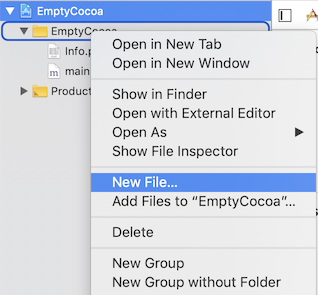
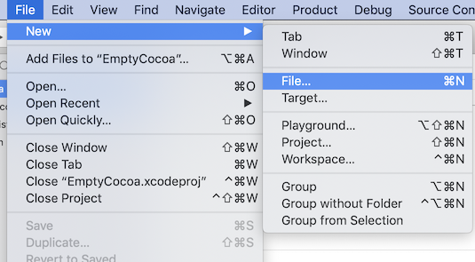
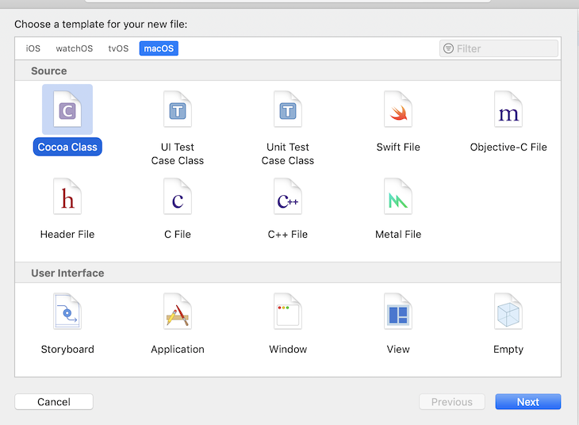
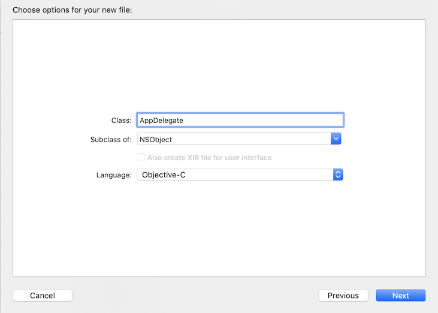
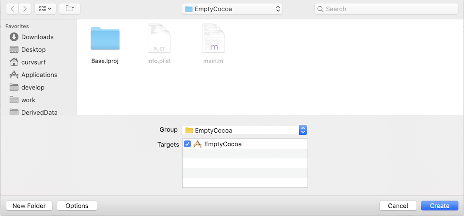

# How to Create Objective-C Class on Xcode

1. Select [File -> New -> File...] from menu or [New File...] from project context menu.   
   We will 

    or 

1. Select [Cocoa Class] then press a \[Next] button
   
   

1. Input your class name then press a \[Next] button

   > NOTE: Class name also be file name of your class. For example, if your class name is "*AppDelegate*", **AppDelegate.h** and **AppDelegate.m** files will be created. 

   

1. Select the location to be created your class file and then press \[Create] button.   
   or If you want to use default location ( Project Location ), just press \[Create] button.

   