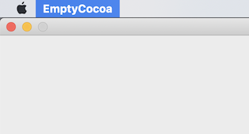

# How to Create Empty Cocoa Application [Object-C Version]

> **NOTE:** Sample codes on this document are written and tested on Xcode 10 ([ARC](https://developer.apple.com/library/archive/releasenotes/ObjectiveC/RN-TransitioningToARC/Introduction/Introduction.html#//apple_ref/doc/uid/TP40011226) is enabled)

## 1. Xcode - Prepare your new Cocoa Project 

Create Cocoa project with following step:

1. Open the Xcode

1. Select [Create a new Xcode project] on the wizard window    
or [File -> New -> Project...] on the menu

1. Select [Object-C] for main language

1. After the project is created, delete all file inside the project except follows: [**main.m, Info.plist**]

## 2. `main()` function

Open a [main.m] file, you can see the code below:

```objc
#import <Cocoa/Cocoa.h>

int main(int argc, const char * argv[]) {
    return NSApplicationMain(argc, argv);
}
```

You can see `NSApplicationMain()` function is called inside the `main()` function

What `NSApplicationMain()` function exactly do inside?

We need at least 3 steps for running cocoa application,

1. Create Application Instance
1. Load your app's main **nib** file   
( **In this step, application will create menu, window(s), view(s) and so on via nib file that produced by Interface Builder )
1. Start Event Loop

`NSApplicationMain()` function does above steps. We can replace `NSApplicationMain()` with below code:

```objc
#import <Cocoa/Cocoa.h>

int main(int argc, const char * argv[]) 
{
    // Step 1. Create Application Instance
    NSApplication *myApp = [NSApplication sharedApplication];

    // Step 2. Load app's main nib file
    [[NSBundle mainBundle] loadNibNamed: @"MainMenu" owner: myApp topLevelObjects: nil]; // macOS 10.8+
    // [NSBundle loadNibNamed: @"MainMenu" owner: myApp]; // Before macOS 10.8

    // Step 3. Start Event Loop
    [myApp run];

    return 0;
}
```

You can create `NSApplication` instance by calling the `sharedApplication` class method. The method returns `NSApplication` instance.

Every Cocoa Application uses single instance of `NSApplication`. They already declared the global vriable for that app instance. The variable's name is `NSApp`. Returned instance from `sharedApplication` method is exactly same as `NSApp`. So you can use `NSApp` instead of `myApp` in above code like below:

```objc
#import <Cocoa/Cocoa.h>

int main(int argc, const char * argv[]) 
{
    // Step 1. Create Application Instance
    [NSApplication sharedApplication];

    // Step 2. Load app's main nib file
    [[NSBundle mainBundle] loadNibNamed: @"MainMenu" owner: NSApp topLevelObjects: nil]; // macOS 10.8+
    // [NSBundle loadNibNamed: @"MainMenu" owner: NSApp]; // Before macOS 10.8

    // Step 3. Start Event Loop
    [NSApp run];

    return 0;
}
```

## 3. Create the Menu and Window programmatically without Interface Builder

Generally, GUI compoents (menu, window, view and so on) are automatically created and link with code on **Step. 2**. It is strongly recommended design your application via Interface Builder. 

This section is for who wants create GUI components programmatically without Interface Builder.

In this section we will rewrite **Step. 2** with our own code. We will discuss how to create next 3 things programmatically.

   1. Application Delegate
   1. Menu
   1. Window

### 3.1. Application Delegate

Before create GUI compoents, if you want replace **Step. 2** with programmatically approach, you should also register Application Delegate manually.

This step is very simple. Create a class for the Application Delegate and implements delegate methods.

First, create a class inherits `NSObject` and ( since macOS 10.6+ ) adopts `NSApplicationDelegate` protocol.

Your class header may looks like below:

```objc
//
// AppDelgate.h
//
#import <Cocoa/Cocoa.h>

@interface AppDelegate : NSObject <NSApplicationDelegate> // adopt `NSApplicationDelgate` protocol
@end
```

> NOTE: If you don't know how to create class follow this instructions: [link: How to create class]()

After create a class, it is recommended to implementing at least 2 methods like below:

```objc
#import "AppDelegate.h"

@implementation AppDelegate

- (void) applicationDidFinishLaunching:(NSNotification *)notification {
    // Will be called before starting event loop
}

- (void) applicationWillTerminate:(NSNotification *)notification {
    // Will be called before terminating an application
}

@end
```

Once you create class for the Application Delegate go back to [main.m] and add code for registering to the Application Instance

```objc
#import <Cocoa/Cocoa.h>
#import "AppDelegate.h" // import your class header for Application Delegate

int main(int argc, const char * argv[]) 
{
    [NSApplication sharedApplication];
    
    // Register Application Delegate to Application Instance
    [NSApp setDelegate: [[AppDelegate alloc] init]];

    [NSApp run];
    return 0;
}
```


### 3.2. Create Menu

All of Cocoa Application have *application menu*. You can see *application menu* via click application name on menu bar.


One of important function of application menu is **Quit** menu item. Generally in macOS, user terminates the application via application menu's **Quit**  menu item. Unfortunatly this is basic things for macOS application but not default implementation. If you do not create or assign the menu to your application, your application do not show any menu.



Creating the menu not using the Interface Builder but programmatically is little bit complicated. Before show a source code, let's look a figure below:


As you can see on figures, there are _**menus**_ on _**menu bar**_ and each _**menu**_ has _**menu items**_ (Note that _sperate line_ is also a _**menu item**_). And we can also think that the _**menus**_ are kind of _**menu items**_ of _**menu**_ that called _**menu bar**_. Then we can represent above figures hierarchically like this:

```text
[Menu Bar] ┬ [Xcode] ┬ [About Xcode]
           |         ├ ... (omit) ...
           |         ├ -- sep. line --
           |         └ [Quit Xcode]
           |
           ├ [File ] ┬ [New ...]
           |         ├ ... (omit) ...
     ... (omit) ...
```

We will create the menu depending on this hierarchical structure. 
Each parent node will be represented by `NSMenu` class and each child node will be represented by `NSMenuItem` class. 
Note that intermediate node like _application menu_ can be both parent and child node. It means that intermediate node will be represented by both `NSMenu` and `NSMenuItem`.

Generally, you can create the `NSMenu` instance like below:

```objc
// Create Menu without Title
NSMenu *menu_1 = [[NSMenu alloc] init]; 

// Create Menu with Title
NSMenu *menu_2 = [[NSMenu alloc] initWithTitle: @"File"];
```

And you can create the `NSMenuItem` like below:

```objc
// Create Menu Item Directly without Title & Action
NSMenuItem *menu_item_1 = [[NSMenuItem alloc] init];

// Create Menu Item Directly with Title & Action
NSMenuItem *menu_item_2 = [[NSMenuItem alloc] initWithTitle: @"Quit App" action: @selector(terminate:) keyEquivalent: @"q"];

// Create Menu Item from instance of `NSMenu` without Title & Action
NSMenuItem *menu_item_3 = [menu_1 addItemWithTitle: @"" action: NULL keyEquivalent: @""];

// Create Menu Item from instance of `NSMenu` with Title & Action
NSMenuItem *menu_item_4 = [menu_1 addItemWithTitle: @"Quit App" action: @selector(terminate:) keyEquivalent: @"q"];

// Separate Line
NSMenuItem *sep_line    = [NSMenuItem separatorItem];
```

> **NOTE:** `keyEquivalent` value is keyboard shortcuts combined with _command_ key. For example, if key equivalent value is _**q**_ the shortcuts key is _`command + q`_

> **NOTE:** Both of `initWithTitle:action:keyEquivalent:` and `addItemWithTitle:action:keyEquivalent:`
> * `title` value must not be `nil`. If there is no title, sepcify an empty NSString ( `@""` )
> * `action` value must be a valid _selector_ or `NULL` (or `nil`)
> * `keyEquivalent` value must not be `nil`. If there is no key equivalent, sepcify an empty NSString ( `@""` )

#### 3.2.1 Create Simple Menu

##### Step 1. Create Menu Bar
```objc
// Create NSMenu instance for representing [Menu Bar]
NSMenu *menu_bar = [[NSMenu alloc] init]; // Menu Bar do not need a Title
```

##### Step 2. Create Application Menu
```objc
// Create NSMenu instance for representing [Application Menu]
NSMenu *app_menu = [[NSMenu alloc] init]; // Application Menu also do not need a Title

// You can fill the [Application Menu] like this:
[app_menu addItemWithTitle: @"About" action: NULL keyEquivalent: @""]; // no action -> menu item will be disabled automatically
[app_menu addItem: [NSMenuItem separatorItem]]; // You can add separate line like this
// ... (omit) ...
[app_menu addItemWithTitle: @"Quit" action: @selector(terminate:) keyEquivalent: @"q"];
```

##### Step 3. Add Application Menu to Menu Bar

Remember that _\[Application Menu]_ is also Menu Item of _\[Menu Bar]_. 
So we have to represent _\[Application Menu]_ to `NSMenuItem` for adding to _\[Menu Bar]_.

```objc
NSMenuItem *app_menu_as_item = [[NSMenuItem alloc] init]; // No Title & Action
[app_menu_as_item setSubmenu: app_menu]; // Set <app_menu> as sub menu of menu item

// Now add [Application Menu] to [Menu Bar]
[menu_bar addItem: app_menu_as_item];
```

or

```objc
NSMenuItem *app_menu_as_item = [menu_bar addItemWithTitle: @"" action: NULL keyEquivalent: @""]; // No Title & Action
[app_menu_as_item setSubmenu: app_menu]; // Set <app_menu> as sub menu of menu item
```

##### Step 4. Set to Application Instance

Finally, we have to set our \[Menu] to application instance.

```objc
[NSApp setMainMenu: menu_bar];
```

##### Step Extra1. Add another Menu to Menu Bar

Unlike _Application Menu_, the usual menu has it's own title. we can set a title of the menu when we create a `NSMenu` instance. Without that, rest of create process is same with _Application Menu_.

```objc
NSMenu *file_menu = [[NSMenu alloc] initWithTitle: @"File"]; // Set Title when creating NSMenu instance

[file_menu addItemWithTitle: @"New" action: @selector(newFile:) keyEquivalent: @"n"];
[file_menu addItem: [NSMenuItem separatorItem]]; // separate line
// ... (omit) ...

NSMenuItem *app_menu_as_item = [menu_bar addItemWithTitle: @"" action: NULL keyEquivalent: @""]; // No Title & Action
[file_menu_as_item setSubmenu: file_menu];
```

##### Step Extra2. Sub Menu of Menu


How can we create a sub menu for specific menu item? Remember the hierarchical structure. We already know that intermediate node is represented by both `NSMenu` and `NSMenuItem`. And we already did this step when create the _Application Menu_ and usual _Menu_. 

The create process of sub menu is exactly same with the usual menu only except one thing. We set the title for usual menu (on _Menu Bar_) while creating `NSMenu` instance. But for Sub Menu, title will be set when creating `NSMenuItem` instance.

```objc
// Create Sub Menu
NSMenu *new_sub_menu = [[NSMenu alloc] init]; // Unlike menus on [Menu Bar], title is not specified here.

[new_sub_menu addItemWithTitle: @"File..." action: @selector(newFile:) keyEquivalent: @"n"];
[new_sub_menu addItemWithTitle: @"Project..." action: @selector(newProject:) keyEquivalent: @"N"];
// ... (omit) ...

// Add Sub Menu to Menu Item
NSMenuItem *new_sub_menu_as_item = [file_menu addItemWithTitle: @"New" action: NULL keyEquivalent: @""]; // Set Title Here
[new_sub_menu_as_item setSubmenu: new_sub_menu];
```

#### 3.2.2 Action & Target ( Receiver of Menu Item's Message )

We can set the method, which is performed on selecting menu item, to `action` parameter via selector. If you specified invalid selector or NULL value to `action` parameter, then the menu item is disabled automatically.

We specified method to `action` parameter via selector but did not specified a target of the method. Which object will be received message and perform the method? How can we set a target of the method?

There is a `target` parameter in the `NSMenuItem`. We can set target of selector method via this parameter.

If the menu item's `target` is not specified, then menu item uses the [Responder Chain](https://developer.apple.com/library/archive/documentation/Cocoa/Conceptual/EventOverview/EventArchitecture/EventArchitecture.html#//apple_ref/doc/uid/10000060i-CH3-SW2). The Responder Chain is the following for single window application:

1. The main window’s first responder and the successive responder objects up the view hierarchy
1. The main window itself
1. The main window’s delegate (which need not inherit from NSResponder)
1. The application object, NSApp
1. The application object’s delegate (which need not inherit from NSResponder)


Generally, methods for selector are implemented in window or application delegate object. Some people implement the method on inherit class of `NSWindow` or `NSApplication`.

> **NOTE:** If you want more information, reference follow link: [Target-Action](https://developer.apple.com/library/archive/documentation/General/Conceptual/CocoaEncyclopedia/Target-Action/Target-Action.html)

##### Implement to Application Delegate

Simply implements new method to your application delegate that previously created. For example, let's assume that you want to append following two menu items.

```objc
[new_sub_menu addItemWithTitle: @"File..." action: @selector(newFile:) keyEquivalent: @"n"];
[new_sub_menu addItemWithTitle: @"Project..." action: @selector(newProject:) keyEquivalent: @"N"];
```

What only have to do is implements those two methods specified to selector like below:

```objc
#import "AppDelegate.h"

@implementation AppDelegate

// ... (omit) ...

- (void) newFile: (id) sender
{
    // When [File...] menu item is selected,
}

- (void) newProject: (id) sender
{
    // When [Project...] menu item is selected,
}

@end
```

##### Add New Class

You should create a class for handling selector method which will be specified to `target`. Let's assume that the class name is `FileManager`.

header of class (option)
```objc
#include <Cocoa/Cocoa.h>

@interface FileManager

// Defining methods on your header is optional
- (void) newFile: (id) sender;
- (void) newProject: (id) sender;

@end
```

source file of class
```objc
#import "FileManager.h"

@implementation FileManager

- (void) newFile: (id) sender
{
    // When [File...] menu item is selected,
}

- (void) newProject: (id) sender
{
    // When [Project...] menu item is selected,
}

@end
```

After that, specify the `target` value as instance of our class when you append menu item.

```objc
#import "FileManager.h"

//... (omit) ...
FileManager * __autoreleasing fm = [[FileManager alloc] init];
NSMenuItem *item = nil;

item = [new_sub_menu addItemWithTitle: @"File..." action: @selector(newFile:) keyEquivalent: @"n"];
[item setTarget: fm];

item = [new_sub_menu addItemWithTitle: @"Project..." action: @selector(newProject:) keyEquivalent: @"N"];
[item setTarget: fm];
//... (omit) ...
```

or

```objc
[[new_sub_menu addItemWithTitle: @"File..." action: @selector(newFile:) keyEquivalent: @"n"] setTarget: fm];
[[new_sub_menu addItemWithTitle: @"Project..." action: @selector(newProject:) keyEquivalent: @"N"] setTarget: fm];
```

> **!NOTE!:** If you are using _ARC_ and allocate `FileManager` instance for _local variable_, you have to use `__autoreleasing` keyword. For example, assume that you create the menu in some function.
>
> ```objc
> static void createMyMenu()
> {
>     NSMenu *menu_bar = [[NSMenu alloc] init];
>
>     //... (omit) ...
>
>     FileManager *fm = [[FileManager alloc] init]; // this instance will be released on end of this function
> 
>     [new_sub_menu addItemWithTitle: @"File..." action: @selector(newFile:) keyEquivalent: @"n"] setTarget: fm];
>     [new_sub_menu addItemWithTitle: @"Project..." action: @selector(newProject:) keyEquivalent: @"N"] setTarget: fm];
>
>     //... (omit) ...
> 
>     [NSApp setMainMenu: menu_bar];
> }
> 
> int main(int argc, const char * argv[]) {
>     [NSApplication sharedApplication]; 
>     [NSApp setDelegate: [[AppDelegate alloc] init]];
>
>     createMyMenu();
>
>     [NSApp run];
>     return 0;
> }
> ```
> 
> Without `__autoreleasing` keyword, `FileManager` instance will be released automatically after run the `createMyMenu()` function.
> It means there is no instance for running method when application is launching. So menu item will be disabled.
> Have a try with `__autoreleasing` keyword and check the result yourself.


#### 3.2.3 Key Equivalent (Keyboard Shortcuts)

We can set the keyboard shorcuts of Menu Item by setting the `keyEquivalent` parameter. `keyEquivalent` parameter accepts single character string that representing keyboard key. 

Default combination of `keyEquivalent` is _command_ key. For example, if you specify the `keyEquivalent` value as "_q_" then we can call menu item with `command + q` shortcuts. 

You can change the combination key via `NSMenuItem`'s `keyEquivalentModifierMask` property:

```objc
NSMenu *app_menu = [[NSMenu alloc] init];

[app_menu addItemWithTitle: @"Hide" action: @selector(hideMyWindow:) keyEquivalent: @"h"]; // command + keyEquivalent

NSMenuItem *menu_item = [app_menu addItemWithTitle: @"Hide All" action: @selector(hideAllWindow:) keyEquivalent: @"h"];
[menu_item setKeyEquivalentModifierMask: NSEventModifierFlagCommand | NSEventModifierFlagOption]; // option + commnad + keyEquivalent
```

> **NOTE:** Flag names used before macOS 10.12 (ex&gt; NSCommandKeyMask, NSShiftKeyMask, and so on) are deprecated. See [here](https://developer.apple.com/documentation/appkit/nseventmodifierflags?language=objc)


Note that in case of alphabet key if you set the `keyEquivalent` value as _**uppercase**_ character _shift_ key is added automatically to combination key. So if you do not want add _shift_ key, you should set the `keyEquivalent` value as _**lowercase**_.


### 3.3 Create Window

On cocoa application root of view (graphical content) is window object. A window represented by `NSWindow` object.

> More details of window object are here: [Window Object](https://developer.apple.com/library/archive/documentation/General/Devpedia-CocoaApp-MOSX/Window.html)

To creating a window is very simple compared with the menu. What we only have to do is determine window style, size and position.
Generally, you can create `NSWindow` instance with `initWithContentRect:styleMask:backing:defer:` method. 

```objc
// from macOS 10.12+, NS{style}WindowMask is deprectated, inestead use NSWindowStyleMask{style}
NSUInteger wndStyle = NSWindowStyleMaskTitled 
                    | NSWindowStyleMaskClosable 
                    | NSWindowStyleMaskMiniaturizable
                    | NSWindowStyleMaskResizable;

NSRect wndRect;
wndRect.origin.x    = 0;   // x position from screen left
wndRect.origin.y    = 0;   // y position from screen bottom
wndRect.size.width  = 800; // width for content area (not include window frame)
wndRect.size.height = 600; // height for content area (not include window frame)

NSWindow *window = [[NSWindow alloc] initWithContentRect: wndRect 
                                     styleMask:           wndStyle 
                                     backing:             NSBackingStoreBuffered 
                                     defer:               YES];
```

> **NOTE:** Window style flag name has been changed on macOS 10.12+. See more detail [here](https://developer.apple.com/documentation/appkit/nswindowstylemask?language=objc)

After create window you can specify window's title with `title` property.

```objc
[window setTitle: @"your title here"];
```

Finally, make this window as active window (key window) and show on screen.

```objc
[window makeKeyAndOrderFront: nil];
```

### Appendix. Full Version of Sample Code

* `AppDelgate.h`

```objc
#import <Cocoa/Cocoa.h>

@interface AppDelegate : NSObject <NSApplicationDelegate> 
@end
```

* `AppDelegate.m`

```objc
#import "AppDelegate.h"

@implementation AppDelegate

- (void) applicationDidFinishLaunching:(NSNotification *)notification
{
    NSLog(@"applicationDidFinishLaunching");
}

- (void) applicationWillTerminate:(NSNotification *)notification
{
    NSLog(@"applicationWillTerminate");
}

@end
```

* `main.m`

```objc
#import <Cocoa/Cocoa.h>
#import "AppDelegate.h"

int main(int argc, const char * argv[]) {
    [NSApplication sharedApplication];

    // Set Delegate
    [NSApp setDelegate: [[AppDelegate alloc] init]];

    // Create Menu
    {
        NSMenu *menu_bar = [[NSMenu alloc] init];

        // Create App Menu
        NSMenu *app_menu = [[NSMenu alloc] init];
        [app_menu addItemWithTitle: @"Quit" action: @selector(terminate:) keyEquivalent: @"q"];

        // Append to Menu Bar
        [[menu_bar addItemWithTitle: @"" action: NULL keyEquivalent: @""] setSubmenu: app_menu];

        // Append to Application Instance
        [NSApp setMainMenu: menu_bar];
    }

    // Create Window
    {
        NSUInteger wndStyle = NSWindowStyleMaskTitled 
                            | NSWindowStyleMaskClosable 
                            | NSWindowStyleMaskMiniaturizable
                            | NSWindowStyleMaskResizable;

        NSRect wndRect;
        wndRect.origin.x    = 0;   // x position from screen left
        wndRect.origin.y    = 0;   // y position from screen bottom
        wndRect.size.width  = 800; // width for content area (not include window frame)
        wndRect.size.height = 600; // height for content area (not include window frame)

        // Recalculate window position to center of screen
        {
            NSRect scrRect   = [[[NSScreen screens] objectAtIndex: 0] visibleFrame]; // screen size without [Menu Bar] and [Dock]
            NSRect frameRect = [NSWindow frameRectForContentRect: wndRect styleMask: wndStyle]; // Get Real Window Size (include frame)

            wndRect.origin.x = scrRect.origin.x + ( (scrRect.size.width  - frameRect.size.width)  / 2 );
            wndRect.origin.y = scrRect.origin.y + ( (scrRect.size.height - frameRect.size.height) / 2 );
        }

        NSWindow *window = [[NSWindow alloc] initWithContentRect: wndRect 
                                             styleMask:           wndStyle 
                                             backing:             NSBackingStoreBuffered 
                                             defer:               YES];

        [window setTitle: @"Test Window"];
        [window makeKeyAndOrderFront: nil];
    }

    [NSApp run];
    return 0;
}
```