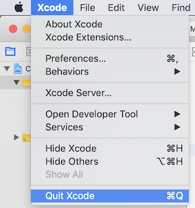
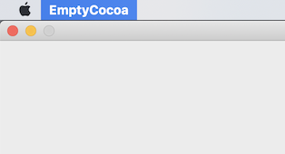
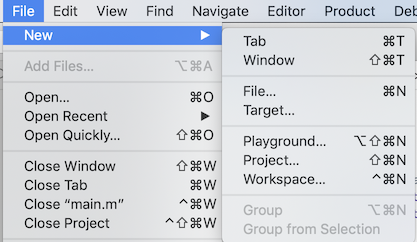
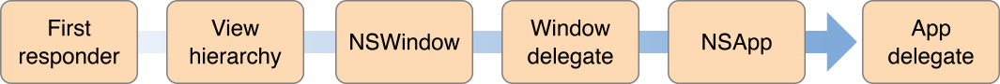

# 코코아 앱 수동으로 만들기 [Objective-C Version]

> **NOTE:** 이 문서에 사용된 소스 코드는 Xcode 10에서 작성 및 테스트 되었습니다 ([ARC](https://developer.apple.com/library/archive/releasenotes/ObjectiveC/RN-TransitioningToARC/Introduction/Introduction.html#//apple_ref/doc/uid/TP40011226) 사용)

## 1. Xcode - 새로운 코코아 프로젝트 준비하기

다음과 같이 코코아 프로젝트를 만듭니다:

1. Xcode를 엽니다

1. 마법사 창에서 [Create a new Xcode project] 를 선택하거나     
   메뉴에서 [File -> New -> Project...] 를 선택합니다

1. \[Object-C] 언어를 선택합니다

1. 프로젝트가 생성되면, 다음 2 파일을 제외한 모든 파일을 제거 합니다: [**main.m, Info.plist**]

## 2. `main()` 함수

\[main.m] 파일을 열어봅시다. 다음과 같은 코드가 작성되어 있을 것입니다:

```objc
#import <Cocoa/Cocoa.h>

int main(int argc, const char * argv[]) {
    return NSApplicationMain(argc, argv);
}
```

`main()` 함수 안에서 `NSApplicationMain()` 함수가 호출되고 있습니다. 그렇다면, `NSApplicationMain()` 함수는 도대체 내부에서 어떤 일을 하는걸까요?

일반적으로 코코아 어플리케이션이 실행되기 위해서는 적어도 다음 3가지 과정이 필요합니다:

1. 어플리케이션 인스턴스 생성하기
1. 메인 **nib** 파일 읽어들이기   
( **이 과정에서 메뉴, 윈도우, 뷰 등이 자동으로 생성됩니다. nib 파일은 인터페이스 빌더를 통해서 작성됩니다 )
1. 이벤트 루프 시작하기

`NSApplicationMain()` 함수가 바로 이런 일들을 수행합니다. `NSApplicationMain()` 부분을 다음과 같이 치환해도 정상적으로 동작합니다:

```objc
#import <Cocoa/Cocoa.h>

int main(int argc, const char * argv[]) 
{
    // Step 1. 어플리케이션 인스턴스 생성
    NSApplication *myApp = [NSApplication sharedApplication];

    // Step 2. 메인 nib 파일 읽어들이기
    [[NSBundle mainBundle] loadNibNamed: @"MainMenu" owner: myApp topLevelObjects: nil]; // macOS 10.8+
    // [NSBundle loadNibNamed: @"MainMenu" owner: myApp]; // macOS 10.8 이전

    // Step 3. 이벤트 루프 시작하기
    [myApp run];

    return 0;
}
```

`NSApplication` 인스턴스는 클래스 메소드 인 `sharedApplication`을 통해서 생성할 수 있습니다. 이 메소드는 생성한  `NSApplication` 인스턴스를 리턴합니다.

모든 코코아 어플리케이션은 단일 `NSApplication` 인스턴스를 사용합니다. 그래서 미리 해당 인스턴스 접근을 위한 `NSApp` 이라는 전역변수가 선언되어 있습니다. 일단 `sharedApplication` 메소드를 통해서 인스턴스를 생성하면 `NSApp`을 통해서도 해당 인스턴스에 접근이 가능합니다. 앞서 `sharedApplication` 메소드를 통해서 받은 인스턴스는 `NSApp`과 동일한 인스턴스 이기 때문에 위 코드에서 `myApp`대신 `NSApp`으로 치환하더라도 아무 문제가 없으며, 일반적으로 `NSApp`을 더 많이 사용합니다.

```objc
#import <Cocoa/Cocoa.h>

int main(int argc, const char * argv[]) 
{
    // Step 1. 어플리케이션 인스턴스 생성
    [NSApplication sharedApplication];

    // Step 2. 메인 nib 파일 읽어들이기
    [[NSBundle mainBundle] loadNibNamed: @"MainMenu" owner: NSApp topLevelObjects: nil]; // macOS 10.8+
    // [NSBundle loadNibNamed: @"MainMenu" owner: NSApp]; // macOS 10.8 이전

    // Step 3. 이벤트 루프 시작하기
    [NSApp run];

    return 0;
}
```

## 3. 인터페이스 빌더를 사용하지 않고 프로그램 코드로만 메뉴와 윈도우 생성하기

일반적으로 GUI 요소 (메뉴, 윈도우, 뷰 등) 들은 **Step. 2**에서 자동으로 생성 및 코드와 연결 됩니다. 당연한 이야기지만 인터페이스 빌더를 사용하여 어플리케이션을 만드는 것이 일반적이며 또한 강력히 추천 합니다.

이 섹션은 이러한 GUI 요소들이 실제로는 어떤 코드에 의해서 생성되는지 궁금한 사람들을 위해서 작성한 내용입니다. 인터페이스 빌더를 사용하지 않고, **Step. 2**에서 처리할 법한 일들을 직접 코드로 작성해 보려고 합니다. 다음 3가지를 어떻게 만드는지 알아 봅시다:

   1. Application Delegate (앱 델리게이트)
   1. Menu (메뉴)
   1. Window (윈도우)

### 3.1. Application Delegate

실질적인 GUI 요소들을 생성해 보기 전에 만약 **Step. 2** 과정을 프로그래밍 방식으로 바꾸실 때 제일 먼저 할 일은 Application Delegate를 수동으로 등록해 주는 일입니다.

이 과정은 매우 간단합니다. Delegate 메소드를 구현할 클래스를 만들고 등록해 주시면 됩니다.

먼저, 클래스를 만들어봅시다. 단순히 `NSObject` 을 상속받는 클래스를 정의하시면 됩니다. macOS 10.6+ 이시면 `NSApplicationDelegate` 프로토콜을 적용해 줍시다.

클래스 헤더 파일은 대충 다음과 같은 모양이 됩니다.

```objc
//
// AppDelgate.h
//
#import <Cocoa/Cocoa.h>

@interface AppDelegate : NSObject <NSApplicationDelegate> // `NSApplicationDelegate` 프로토콜 적용
@end
```

> NOTE: 클래스 만드는 법을 모르면 다음 링크를 참조하시기 바랍니다: [link: 클래스 만들기]()

일단 클래스를 만들었다면, 다음 2가지 메소드는 가능하면 구현하도록 합시다:

```objc
#import "AppDelegate.h"

@implementation AppDelegate

- (void) applicationDidFinishLaunching:(NSNotification *)notification {
    // 이벤트 루프 시작 직전에 호출
}

- (void) applicationWillTerminate:(NSNotification *)notification {
    // 어플리케이션 종료 직전에 호출
}

@end
```

클래스를 생성했다면 \[main.m] 파일로 돌아가서 앱 인스턴스에 등록하도록 하겠습니다.

```objc
#import <Cocoa/Cocoa.h>
#import "AppDelegate.h" // Application Delegate 클래스 헤더를 import

int main(int argc, const char * argv[]) 
{
    [NSApplication sharedApplication];
    
    // 앱 인스턴스에 Application Delegate 등록하기
    [NSApp setDelegate: [[AppDelegate alloc] init]];

    [NSApp run];
    return 0;
}
```

### 3.2. 메뉴 만들기

모든 코코아 어플리케이션은 *어플리케이션 메뉴* 가 존재합니다. *어플리케이션 메뉴* 는 메뉴 바 위에 어플리케이션 이름으로 존재합니다.



어플리케이션 메뉴의 주 기능 중 하나는 **종료(Quit)** 메뉴 항목입니다. 일반적으로 macOS에서 메뉴를 통해 어플리케이션을 종료 시킬 때는 어플리케이션 메뉴에 있는 **종료(Quit)**  메뉴 항목을 이용합니다. 거의 모든 어플리케이션이 그렇기 때문에 OS차원에서 지원해 주는 기본 기능으로 생각할 수 있으나, 엄연히 직접 구현해야 하는 부분입니다. 만약 어플리케이션 메뉴 자체를 만들지 않는다면 아래 그림과 같이 아무 메뉴도 갖지 않게됩니다.



메뉴를 인터페이스 빌더를 이용하지 않고 직접 만들고자 한다면 그 과정이 조금 복잡합니다. 바로 코드를 설명하기 전에 우선 아래 그림을 보도록 하겠습니다.


그림을 보면, _**메뉴 바**_ 위에 일반 _**메뉴**_ 들이 보이고, 각각의 _**메뉴**_ 들은 _**메뉴 항목 (Menu Item)**_ ( _구분선_ 역시 _**메뉴 항목**_ 입니다 ) 을 가지고 있다. 그리고 다른 관점에서 보면 _**메뉴**_ 들은 _**메뉴 바**_라는 이름의 _**메뉴**_ 위에 있는 일종의 _**메뉴 항목**_으로 생각해 볼 수도 있습니다. 위 그림의 메뉴들은 다음과 같이 계층적 구조로 표현해 볼 수 있습니다.

```text
[Menu Bar] ┬ [Xcode] ┬ [About Xcode]
           |         ├ ... (생략) ...
           |         ├ -- 구분선 --
           |         └ [Quit Xcode]
           |
           ├ [File ] ┬ [New ...]
           |         ├ ... (생략) ...
     ... (생략) ...
```

이제 이 계층적 구조를 따라서 메뉴를 생성해 볼 것입니다.
각각의 부모 노드들은 `NSMenu`로, 각각의 자식 노드들은 `NSMenuItem` 클래스를 이용해 나타낼 것입니다. _어플리케이션 메뉴_ 와 같은 중간 노드들은 부모 노드인 동시에 자식 노드인 점을 주목하도록 합시다. 이런 중간 노드들은 `NSMenu`와 `NSMenuItem` 클래스를 같이 사용하여 표현해야 합니다.

일반적으로 `NSMenu` 인스턴스는 다음과 같이 생성합니다:

```objc
// 이름 없이 생성하기
NSMenu *menu_1 = [[NSMenu alloc] init]; 

// 이름을 주면서 생성하기
NSMenu *menu_2 = [[NSMenu alloc] initWithTitle: @"File"];
```

그리고 `NSMenuItem`은 다음과 같이 생성합니다:

```objc
// 이름 및 행동 지정없이 직접 생성하기
NSMenuItem *menu_item_1 = [[NSMenuItem alloc] init];

// 이름 및 행동을 지정하며 직접 생성하기
NSMenuItem *menu_item_2 = [[NSMenuItem alloc] initWithTitle: @"Quit App" action: @selector(terminate:) keyEquivalent: @"q"];

// NSMenu 로 부터 이름 및 행동 지정없이 생성하기
NSMenuItem *menu_item_3 = [menu_1 addItemWithTitle: @"" action: NULL keyEquivalent: @""];

// NSMenu 로 부터 이름 및 행동을 지정하고 생성하기
NSMenuItem *menu_item_4 = [menu_1 addItemWithTitle: @"Quit App" action: @selector(terminate:) keyEquivalent: @"q"];

// 구분선 생성하기
NSMenuItem *sep_line    = [NSMenuItem separatorItem];
```

> **NOTE:** `keyEquivalent` 값은 _command_ 키와 조합 할 단축키를 의미합니다. 예를 들어, _**q**_ 값을 지정하면 단축키는 _`command + q`_ 가 됩니다.

> **NOTE:** `initWithTitle:action:keyEquivalent:` 와 `addItemWithTitle:action:keyEquivalent:` 는
> * `title` 값으로 `nil`을 지정하면 안됩니다. 이름이 없다면 빈 문자열( `@""` )을 사용해야 합니다.
> * `action` 값으로 유효한 _selector_ 나 `NULL` (or `nil`) 을 지정해야 합니다.
> * `keyEquivalent` 값으로 `nil`을 지정하면 안됩니다. 단축키를 지정하고 싶지 않다면 빈 문자열( `@""` )을 사용해야 합니다.

#### 3.2.1 간단한 메뉴 만들어 보기

##### Step 1. 메뉴 바 만들기
```objc
// [Menu Bar] 역할을 할 NSMenu 인스턴스를 생성
NSMenu *menu_bar = [[NSMenu alloc] init]; // Menu Bar 이므로 별도로 이름이 없음
```

##### Step 2. 어플리케이션 메뉴 만들기
```objc
// [어플리케이션 메뉴] 역할을 할 NSMenu 인스턴스를 생성
NSMenu *app_menu = [[NSMenu alloc] init]; // 어플리케이션 메뉴도 역시 이름이 없음

// 하위 메뉴 항목들은 다음과 같이 추가할 수 있습니다
[app_menu addItemWithTitle: @"About" action: NULL keyEquivalent: @""]; // action 을 지정하지 않으면 메뉴 항목은 자동으로 비활성화 상태로 표시
[app_menu addItem: [NSMenuItem separatorItem]]; // 구분선은 이런 식으로 추가
// ... (생략) ...
[app_menu addItemWithTitle: @"Quit" action: @selector(terminate:) keyEquivalent: @"q"];
```

##### Step 3. 어플리케이션 메뉴를 메뉴 바에 추가한다

앞서 우리는 _\[어플리케이션 메뉴]_ 은 _\[메뉴 바]_ 의 메뉴 항목 (Menu Item) 으로 생각해 볼 수 있다고 하였습니다. 그러므로 _\[메뉴 바]에 _\[어플리케이션 메뉴]를 추가하기 위해서는 _\[어플리케이션 메뉴]_ 를 `NSMenuItem`으로 표현해야 합니다.

```objc
NSMenuItem *app_menu_as_item = [[NSMenuItem alloc] init]; // 이름과 행동 없음
[app_menu_as_item setSubmenu: app_menu]; // <app_menu>를 NSMenuItem의 서브 메뉴로 지정

// 이제 [어플리케이션 메뉴]를 [메뉴 바]에 추가할 수 있습니다
[menu_bar addItem: app_menu_as_item];
```

또는 다음과 같이 추가할 수도 있습니다.

```objc
NSMenuItem *app_menu_as_item = [menu_bar addItemWithTitle: @"" action: NULL keyEquivalent: @""]; // 이름과 행동 없음
[app_menu_as_item setSubmenu: app_menu]; // <app_menu>를 NSMenuItem의 서브 메뉴로 지정
```

##### Step 4. 어플리케이션에 메뉴로 설정하기

마지막으로 메뉴를 어플리케이션 인스턴스에 설정합니다

```objc
[NSApp setMainMenu: menu_bar];
```

##### Step Extra1. 메뉴 바에 다른 메뉴 추가하기

_어플리케이션 메뉴_ 와는 다르게 일반 메뉴들은 자신의 이름을 가지고 있습니다. 메뉴의 이름은 `NSMenu` 인스턴스를 생성할 때 지정해 줄 수 있습니다. 이름을 지정한다는 것 이외에 생성과정은 _어플리케이션 메뉴_ 와 동일합니다.

```objc
NSMenu *file_menu = [[NSMenu alloc] initWithTitle: @"File"]; // NSMenu 인스턴스를 만들 때 이름을 지정

[file_menu addItemWithTitle: @"New" action: @selector(newFile:) keyEquivalent: @"n"];
[file_menu addItem: [NSMenuItem separatorItem]]; // 구분선
// ... (생략) ...

NSMenuItem *app_menu_as_item = [menu_bar addItemWithTitle: @"" action: NULL keyEquivalent: @""];
[file_menu_as_item setSubmenu: file_menu];
```

##### Step Extra2. 메뉴의 하위 메뉴



특정 메뉴 항목에 하위 메뉴는 어떻게 만들면 될까요? 앞서 살펴보았던 계층적 구조를 기억해 보도록 합시다. 중간 노드들은 `NSMenu`와 `NSMenuItem`으로 동시에 표현된다는 사실을 우리는 이미 알고 있습니다. 그리고 바로 직전에 _어플리케이션 메뉴_ 와 일반 _메뉴_ 를 만들면서 실제 구현 과정도 살펴보았습니다.

하위 메뉴를 만드는 과정은 딱 한가지를 제외하고는 일반 메뉴를 만드는 과정과 동일합니다. (메뉴 바에 있는) 일반 메뉴를 만들 때는 메뉴의 이름을 `NSMenu` 인스턴스를 생성할 때 지정했다면, 하위 메뉴의 경우는 메뉴 이름을 `NSMenuItem` 인스턴스를 생성할 때 지정합니다.

```objc
// 하위 메뉴 만들기
NSMenu *new_sub_menu = [[NSMenu alloc] init]; // (메뉴 바에 있는) 일반 메뉴와 다르게 이름을 여기서 지정하지 않습니다

[new_sub_menu addItemWithTitle: @"File..." action: @selector(newFile:) keyEquivalent: @"n"];
[new_sub_menu addItemWithTitle: @"Project..." action: @selector(newProject:) keyEquivalent: @"N"];
// ... (omit) ...

// 메뉴 항목에 하위 메뉴 추가하기
NSMenuItem *new_sub_menu_as_item = [file_menu addItemWithTitle: @"New" action: NULL keyEquivalent: @""]; // 여기서 이름을 지정합니다
[new_sub_menu_as_item setSubmenu: new_sub_menu];
```

#### 3.2.2 action 그리고 target (메뉴 항목 메시지 수신자)

메뉴 항목을 선택했을 때 어떠한 행동을 취할 것인지는 `action` 패러미터에 유효한 selector를 지정하여 설정할 수 있습니다. 만약 유효하지 않은 selector나 NULL 값을 지정하는 경우 메뉴 항목은 자동으로 비활성화 됩니다. 

그런데 `action` 패러미터에 selector를 이용해 호출할 메소드를 지정하긴 했지만, 실제 누가 이 메소드를 호출할지는 지정하지 않았습니다. 도대체 누가 메시지를 수신하고 지정한 메소드를 호출하게 될까요? 메시지를 수신하고 메소드를 호출하게 될 대상 (target) 을 직접 지정할 수는 없을까요?

`NSMenuItem` 클래스에는 `target` 이라는 프로퍼티가 존재합니다. 해당 프로퍼티를 통해서 메시지를 수신하고 메소드를 호출 할 대상 (target)을 지정할 수 있습니다. 

그렇다면 `target`을 설정하지 않은 경우, 즉 기본 수신자는 누구일까요? `target`을 지정하지 않은 경우에는 [Responder Chain](https://developer.apple.com/library/archive/documentation/Cocoa/Conceptual/EventOverview/EventArchitecture/EventArchitecture.html#//apple_ref/doc/uid/10000060i-CH3-SW2) 에 따라서 수신자가 결정됩니다. 일반적으로 단일 윈도우 환경에서 Responder Chain은 아래와 같습니다:

1. 주 윈도우 상의 First Responder 와 뷰 계층 구조의 Responder 객체
1. 주 윈도우 객체
1. 주 윈도우에 등록된 delegate 객체
1. 어플리케이션 인스턴스 ( NSApp )
1. 어플리케이션 인스턴스에 등록된 delegate 객체



일반적으로는 윈도우 또는 어플리케이션 delegate 객체에 구현을 많이 합니다만, `NSWindow` 또는 `NSApplication`을 상속받아서 클래스내에 메소드를 구현하시는 분들도 많습니다.

> **NOTE:** Target과 Action에 대해 더 자세히 알고 싶은 사람은 다음 링크를 참조하십시오: [Target-Action](https://developer.apple.com/library/archive/documentation/General/Conceptual/CocoaEncyclopedia/Target-Action/Target-Action.html)

##### Application Delegate에 추가하기

간단하게 앞서 등록했던 어플리케이션 delegate 클래스에 메소드를 정의하면 됩니다. 가령 아래와 같은 메뉴 항목을 추가했다고 합시다.

```objc
[new_sub_menu addItemWithTitle: @"File..." action: @selector(newFile:) keyEquivalent: @"n"];
[new_sub_menu addItemWithTitle: @"Project..." action: @selector(newProject:) keyEquivalent: @"N"];
```

앞서 정의한 어플리케이션 delegate 클래스에 selector로 지정한 두 메소드를 추가 구현해 주시면 됩니다.

```objc
#import "AppDelegate.h"

@implementation AppDelegate

// ... (생략) ...

- (void) newFile: (id) sender
{
    // [File...] 메뉴 항목을 선택했을 때,
}

- (void) newProject: (id) sender
{
    // [Project...] 메뉴 항목을 선택했을 때,
}

@end
```

##### 새로운 클래스로 추가하기

먼저 `target`으로 지정 할 클래스를 만들어야 합니다. 클래스 이름을 `FileManager` 라고 가정해 봅시다.

클래스 헤더 (option)
```objc
#include <Cocoa/Cocoa.h>

@interface FileManager

// 해당 메소드들은 반드시 헤더에 정의할 필요는 없습니다
- (void) newFile: (id) sender;
- (void) newProject: (id) sender;

@end
```

클래스 소스 파일
```objc
#import "FileManager.h"

@implementation FileManager

- (void) newFile: (id) sender
{
    // [File...] 메뉴 항목을 선택했을 때,
}

- (void) newProject: (id) sender
{
    // [Project...] 메뉴 항목을 선택했을 때,
}

@end
```

이후, 메뉴 항목을 추가할 때, selector를 지정하고 `target` 을 우리가 만든 클래스의 인스턴스로 지정해주면 됩니다

```objc
#import "FileManager.h"

//... (생략) ...
FileManager * __autoreleasing fm = [[FileManager alloc] init];
NSMenuItem *item = nil;

item = [new_sub_menu addItemWithTitle: @"File..." action: @selector(newFile:) keyEquivalent: @"n"];
[item setTarget: fm];

item = [new_sub_menu addItemWithTitle: @"Project..." action: @selector(newProject:) keyEquivalent: @"N"];
[item setTarget: fm];
//... (생략) ...
```

또는 다음과 같이 한 줄로도 처리 가능합니다.

```objc
[[new_sub_menu addItemWithTitle: @"File..." action: @selector(newFile:) keyEquivalent: @"n"] setTarget: fm];
[[new_sub_menu addItemWithTitle: @"Project..." action: @selector(newProject:) keyEquivalent: @"N"] setTarget: fm];
```

> **주의!:** _ARC_ 를 사용 중이며, 만약 `FileManager` 인스턴스가 _지역 변수_ 로 선언된다면 반드시 `__autoreleasing` 키워드를 사용해야 합니다. 가령, 메뉴를 만드는 함수를 따로 정의 했다고 생각해 봅시다.
>
> ```objc
> static void createMyMenu()
> {
>     NSMenu *menu_bar = [[NSMenu alloc] init];
>
>     //... (생략) ...
>
>     FileManager *fm = [[FileManager alloc] init]; // 이 객체는 함수의 실행이 끝날 때 자동으로 릴리즈 된다
> 
>     [new_sub_menu addItemWithTitle: @"File..." action: @selector(newFile:) keyEquivalent: @"n"] setTarget: fm];
>     [new_sub_menu addItemWithTitle: @"Project..." action: @selector(newProject:) keyEquivalent: @"N"] setTarget: fm];
>
>     //... (생략) ...
> 
>     [NSApp setMainMenu: menu_bar];
> }
> 
> int main(int argc, const char * argv[]) {
>     [NSApplication sharedApplication]; 
>     [NSApp setDelegate: [[AppDelegate alloc] init]];
>
>     createMyMenu();
>
>     [NSApp run];
>     return 0;
> }
> ```
> 
> 위의 예제와 같이 `__autoreleasing` 키워드가 없으면 `createMyMenu()` 함수가 실행되고 난 후 `FileManager`의 인스터스가 자동으로 릴리즈 되어버립니다. 
> 그래서 실제 앱이 실행된 순간에는 메소드를 수행 할 인스턴스가 존재하지 않아 메뉴 항목이 비활성화 되어버립니다. 
> 직접 `__autoreleasing` 키워드를 넣고 빼면서 확인해 보도록 합시다


#### 3.2.3 Key Equivalent (키보드 단축키)

`keyEquivalent` 패러미터에 값을 지정하면 메뉴 항목의 키보드 단축키를 설정할 수 있다. `keyEquivalent` 패러미터는 기본적으로 키보드 키를 나타내는 단일 문자의 문자열 형식으로 지정한다.

지정한 키와 기본으로 설정되는 조합키는 _command_ 키 다. 예를 들어, 만약 `keyEquivalent` 값을 "_q_"로 지정한다면 해당 메뉴 항목을 `command + q` 단축키로 실행할 수 있다.

조합키는 `NSMenuItem`의 `keyEquivalentModifierMask` 속성을 통해 바꿀 수 있다.

```objc
NSMenu *app_menu = [[NSMenu alloc] init];

[app_menu addItemWithTitle: @"Hide" action: @selector(hideMyWindow:) keyEquivalent: @"h"]; // command + keyEquivalent

NSMenuItem *menu_item = [app_menu addItemWithTitle: @"Hide All" action: @selector(hideAllWindow:) keyEquivalent: @"h"];
[menu_item setKeyEquivalentModifierMask: NSEventModifierFlagCommand | NSEventModifierFlagOption]; // option + commnad + keyEquivalent
```

> **NOTE:** macOS 10.12 이전에 사용하던 flag 이름 (ex&gt; NSCommandKeyMask, NSShiftKeyMask, 등) 들은 더 이상 지원하지 않는다. [참조 링크](https://developer.apple.com/documentation/appkit/nseventmodifierflags?language=objc)


`keyEquivalent`에 알파벳 키를 지정해서 사용하는 경우, 대문자로 키를 지정하면 자동으로 조합키에 _shift_ 키가 추가된다. _shift_키를 원하지 않는다면 반드시 소문자로 지정해야 한다.

### 3.3 윈도우 만들기

코코아 어플리케이션에서 사용되는 뷰 (모든 그래픽적 요소) 를 감싸는 최상위 객체로 윈도우 객체가 있습니다. 윈도우 객체는 `NSWindow` 클래스로 표현된다. 

> 윈도우 객체에 대한 더 자세한 정보는 링크를 참조하기 바란다: [Window Object](https://developer.apple.com/library/archive/documentation/General/Devpedia-CocoaApp-MOSX/Window.html)

윈도우를 만드는 방법은 메뉴에 비하면 매우 간단하다. 우리가 해야 할 일은 윈도우의 스타일과 크기, 위치를 결정하는 것입니다. 일반적으로 `NSWindow` 인스턴스는 `initWithContentRect:styleMask:backing:defer:` 메소드를 사용하여 생성할 수 있습니다.

```objc
// macOS 10.12+ 부터 NS{style}WindowMask 는 더이상 사용하지 않습니다. 대신 NSWindowStyleMask{style} 을 사용합니다
NSUInteger wndStyle = NSWindowStyleMaskTitled 
                    | NSWindowStyleMaskClosable 
                    | NSWindowStyleMaskMiniaturizable
                    | NSWindowStyleMaskResizable;

NSRect wndRect;
wndRect.origin.x    = 0;   // 스크린 왼쪽으로 부터 X 위치
wndRect.origin.y    = 0;   // 스크린 바닥으로 부터 Y 위치
wndRect.size.width  = 800; // 컨텐츠 영역 (윈도우 프레임은 포함하지 않습니다) 의 가로 길이
wndRect.size.height = 600; // 컨텐츠 영역 (윈도우 프레임은 포함하지 않습니다) 의 세로 길이

NSWindow *window = [[NSWindow alloc] initWithContentRect: wndRect 
                                     styleMask:           wndStyle 
                                     backing:             NSBackingStoreBuffered 
                                     defer:               YES];
```

> **NOTE:** 윈도우 스타일 플래그 이름은 macOS 10.12+ 부터 변경되었습니다. 다음 문서를 참조하세요: [링크](https://developer.apple.com/documentation/appkit/nswindowstylemask?language=objc)

윈도우를 생성한 후에는 `title` 프로퍼티를 이용하여 윈도우 창에 보일 이름을 설정할 수 있습니다.

```objc
[window setTitle: @"여기에 타이틀을 지정하세요"];
```

마지막으로 우리가 만든 윈도우를 (키보드 등의 입력을 받을 수 있도록) 활성화 상태 (active window) 로 만들고 (key window로 지정), 그리고 화면에 띄우도록 합니다.

```objc
[window makeKeyAndOrderFront: nil];
```

### Appendix. 전체 소스코드

* `AppDelgate.h`

```objc
#import <Cocoa/Cocoa.h>

@interface AppDelegate : NSObject <NSApplicationDelegate> 
@end
```

* `AppDelegate.m`

```objc
#import "AppDelegate.h"

@implementation AppDelegate

- (void) applicationDidFinishLaunching:(NSNotification *)notification
{
    NSLog(@"applicationDidFinishLaunching");
}

- (void) applicationWillTerminate:(NSNotification *)notification
{
    NSLog(@"applicationWillTerminate");
}

@end
```

* `main.m`

```objc
#import <Cocoa/Cocoa.h>
#import "AppDelegate.h"

int main(int argc, const char * argv[]) {
    [NSApplication sharedApplication];

    // Delegate 설정하기
    [NSApp setDelegate: [[AppDelegate alloc] init]];

    // Menu 만들기
    {
        NSMenu *menu_bar = [[NSMenu alloc] init];

        // App Menu 만들기
        NSMenu *app_menu = [[NSMenu alloc] init];
        [app_menu addItemWithTitle: @"Quit" action: @selector(terminate:) keyEquivalent: @"q"];

        // 메뉴 바에 추가하기
        [[menu_bar addItemWithTitle: @"" action: NULL keyEquivalent: @""] setSubmenu: app_menu];

        // 앱 인스턴스에 메뉴 설정하기
        [NSApp setMainMenu: menu_bar];
    }

    // Window 만들기
    {
        NSUInteger wndStyle = NSWindowStyleMaskTitled 
                            | NSWindowStyleMaskClosable 
                            | NSWindowStyleMaskMiniaturizable
                            | NSWindowStyleMaskResizable;

        NSRect wndRect;
        wndRect.origin.x    = 0;   // 스크린 왼쪽으로 부터 X 위치
        wndRect.origin.y    = 0;   // 스크린 바닥으로 부터 Y 위치
        wndRect.size.width  = 800; // 컨텐츠 영역 (윈도우 프레임은 포함하지 않습니다) 의 가로 길이
        wndRect.size.height = 600; // 컨텐츠 영역 (윈도우 프레임은 포함하지 않습니다) 의 세로 길이

        // 윈도우 위치를 화면 중앙에 위치하도록 다시 계산
        {
            NSRect scrRect   = [[[NSScreen screens] objectAtIndex: 0] visibleFrame]; // [메뉴 바]와 [독]을 제외한 화면 크기
            NSRect frameRect = [NSWindow frameRectForContentRect: wndRect styleMask: wndStyle]; // (프레임을 포함한) 윈도우의 실제 크기

            wndRect.origin.x = scrRect.origin.x + ( (scrRect.size.width  - frameRect.size.width)  / 2 );
            wndRect.origin.y = scrRect.origin.y + ( (scrRect.size.height - frameRect.size.height) / 2 );
        }

        NSWindow *window = [[NSWindow alloc] initWithContentRect: wndRect 
                                             styleMask:           wndStyle 
                                             backing:             NSBackingStoreBuffered 
                                             defer:               YES];

        [window setTitle: @"Test Window"];
        [window makeKeyAndOrderFront: nil];
    }

    [NSApp run];
    return 0;
}
```