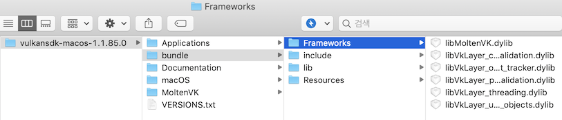

# Getting Started

## 사전 준비

우리는 C/C++ 언어를 사용하여 Vulkan 앱을 개발할 것이다. 당연히 C/C++ 개발 환경이 마련되어 있어야 한다. 본 Tutorial은 Xcode10을 이용해서 작성되었다. 

Xcode의 최신버전은 앱스토어를 통해서 받을 수 있다.

> NOTE: Cross Platform 지원 입장에서는 윈도우 생성에 glfw3와 같은 third-party library를 사용하는 방법도 있을 것이다. glfw3를 이용하여 Vulkan 앱을 만드는 방법은 향후 업데이트 예정이다.

## Metal 지원 여부 확인하기

먼저 Vulkan 개발에 앞서 자신의 맥이 Vulkan을 지원하는지 확인해야 한다. 맥용 Vulkan은 Metal 위에서 동작하기 떄문에 만약 자신의 맥이 Metal을 지원한다면 Vulkan도 돌아간다고 생각하면 된다. os 버전이 10.14+ 이면 무조건 Metal을 지원하는 모델이므로 따로 체크하지 않아도 된다. 반대로 자신의 맥이 10.14로 업그레이드가 안된다면 Metal을 지원하지 않는 버전이므로 포기해야 한다.

## Vulkan SDK

Vulkan 개발에 앞서 우선 SDK를 설치해 보도록 하자.
Vulkan SDK는 LunarG 홈페이지를 통해서 공식 배포되고 있다. 

[https://vulkan.lunarg.com/sdk/home](https://vulkan.lunarg.com/sdk/home)

** 이 문서를 작성한 시점에서 최신버전은 1.1.85.0 버전이다.

1. 먼저 위의 홈페이지에서  vulkansdk-macos-1.1.xx.y.tar.gz 를 다운로드 받는다. (xx.y는 버전)

2. 적당한 곳에 압축을 푼다. 터미널을 이용하는 사람은 아래의 커멘드를 입력하면 된다.
    ```sh
    $ tar -xzf  vulkansdk-macos-1.1.85.0.tar.gz
    ```
    압축을 풀면 `1.1.xx.y` 디렉토리가 생성되어 있을 것이다. 해당 디렉토리의 경로를 이후 `$VULKAN_ROOT` 라고 하겠다.

3. `$VULKAN_ROOT` 디렉토리에 들어가 보면 `macOS` 디렉토리를 찾을 수 있다. 해당 디렉토리 안에 이미 build 되어 있는 SDK 및 Tool 들이 들어있다. 

`$VULKAN_ROOT/macOS/bin` 안에 미리 빌드되어있는 Tool 들은 Command Line Tool 이므로 터미널을 이용하면 편하게 사용할 수 있다. 바로 사용할 수 있도록 `PATH` 환경 변수에 추가하거나 `/usr/local/bin`과 같은 system path에 복사하도록 하자. 특히 `glslangValidator` 은 `glsl` 이나 `hlsl`을 `spir-v`로 컴파일 하기 위해서 자주 사용하므로 미리 준비하도록 하자.

### &gt; Cocoa 어플리케이션 번들을 위한 준비

일반적으로 맥용 앱들은 코코아 어플리케이션 번들로 제공된다. 사용자가 별도로 종속 라이브러리 들을 찾아 설치할 필요없이 번들에 필요한 라이브러리를 모두 패키징 하여 배포하는 방법이다. 현재 Vulkan SDK에서 제공하는 데모 앱도 이 방법을 사용하고 있다.

이 방법은 필수 과정은 아니지만 이 후 프로젝트 생성 때 파일을 편하게 불러오기 위한 사전 준비라고 생각하면 된다.

> NOTE: 당연히 말이지만 아래에 나오는 `$VULKAN_ROOT`는 위에서 언급한 디렉토리 경로로 치환해서 사용해야 한다

1. `$VULKAN_ROOT` 디렉토리 내에 `bundle`이라는 이름으로 새로운 디렉토리를 만든다.

1. `bundle` 디렉토리 내에 다음 4가지 디렉토리를 만든다
	- Frameworks
	- Resources
	- lib
	- include

   

1. 다음 파일 및 디렉토리 들을 복사한다.
	- `$VULKAN_ROOT/macOS/etc/vulkan` 디렉토리를 `$VULKAN_ROOT/bundle/Resources` 에 복사하기
	- `$VULKAN_ROOT/macOS/lib` 및의 다음 파일들을 `$VULKAN_ROOT/bundle/Frameworks`에 복사하기
		* libMoltenVK.dylib
		* libVKLayer_{...}.dylib 파일들
			* libVkLayer_core_validation.dylib
			* libVkLayer_object_tracker.dylib
			* libVkLayer_parameter_validation.dylib
			* libVkLayer_threading.dylib
			* libVkLayer_unique_objects.dylib
	- `$VULKAN_ROOT/macOS/lib/libvulkan.1.1.85.dylib` 파일을 `$VULKAN_ROOT/bundle/lib`에 복사하기
	- `$VULKAN_ROOT/macOS/include/vulkan` 디렉토리를 `$VULKAN_ROOT/bundle/include`에 복사하기

1. 마지막으로 icd 및 layer 용 .json menifest 파일들을 열고 `library_path` 부분을 수정한다.
	* `$VULKAN_ROOT/bundle/Resources/vulkan/icd.d/MoltenVK_icd.json`
		```json
		{
		    "file_format_version" : "1.0.0",
		    "ICD": {
		        // 여기를 수정한다.
		        "library_path": "../../../Frameworks/libMoltenVK.dylib",
		        "api_version" : "1.0.0"
		    }
		}
		```
	* `$VULKAN_ROOT/bundle/Resources/vulkan/explicit_layer.d/VkLayer_{...}.json` 파일들
		
		* VkLayer_core_validation.json
		* VkLayer_object_tracker.json
		* VkLayer_parameter_validation.json
		* VkLayer_threading.json
		* VkLayer_unique_objects.json

		```json
		// example - VkLayer_core_validation.json
		{
		    "file_format_version" : "1.1.0",
		    "layer" : {
		    "name": "VK_LAYER_LUNARG_core_validation",
		    "type": "GLOBAL",
		    // 여기를 수정한다
		    "library_path": "../../../Frameworks/libVkLayer_core_validation.dylib",
		//// 이하 생략 ////
		```

### &gt; Command Line Tool 을 위한 준비

맥에서는 리눅스 시스템과 같이 환경 변수 및 System Path를 이용하는 방법도 허용하고 있다. 단, 이 설정은 터미널 환경에서 gcc 및 make 등을 이용해서 직접 빌드하는 경우와 Xcode 프로젝트 중 Command Line Tool 을 빌드하는 경우에 유효한 방법이다. 

> NOTE: Xcode를 이용하는 경우 System Path에 Header 및 Library를 복사 해 놓더라도 별도로 Header 및 Library Search Path를 설정해 줘야 한다.

> NOTE: 당연히 말이지만 아래에 나오는 `$VULKAN_ROOT`는 위에서 언급한 디렉토리 경로로 치환해서 사용해야 한다

> NOTE: glfw를 이용해 Tutorial 을 진행 할 사람은 System Path에 설치하는 방법을 참조하자. 맥용 glfw를 설치하는 방법은 [\[맥용 glfw 설치하기\]]() 를 참조하자

1. 설치하는 방법은 사람마다 다르다. PATH 및 DYLD_LIBRARY_PATH 환경 변수를 설정하는 방법이 있고, 아니면 /usr/local/lib 와 같이 system path에 직접 Library 파일들을 복사하는 방법도 있다. 필자는 후자를 선호하는 편이다. 아래 두가지 방법 모두 적어놓았으니 자신이 원하는 방법으로 설치하기 바란다.

    #### 1.1. 환경변수를 설정하는 방법

    환경 변수를 직접 설정하고 싶다면 최소 다음 4가지를 등록하면 된다. `export` 명령어를 사용하여 등록해 주자

    | Enviroment Variable | File / Path to Include                                   |
    | ---                 | ---                                                      |
    | PATH                | `$VULKAN_ROOT`/macOS/bin                                 |
    | DYLD_LIBRARY_PATH   | `$VULKAN_ROOT`/macOS/lib                                 |
    | VK_LAYER_PATH       | `$VULKAN_ROOT`/macOS/etc/vulkan/explicit_layer.d         |
	| VK_ICD_FILENAMES    | `$VULKAN_ROOT`/macOS/etc/vulkan/icd.d/MoltenVK_icd.json  |

    ```sh
    $ export PATH=$VULKAN_ROOT/macOS/bin:$PATH
    $ export DYLD_LIBRARY_PATH=$VULKAN_ROOT/macOS/lib:$DYLD_LIBRARY_PATH
    $ export VK_LAYER_PATH=$VULKAN_ROOT/macOS/etc/vulkan/explicit_layer.d
	$ export VK_ICD_FILENAMES=$VULKAN_ROOT/macOS/etc/vulkan/icd.d/MoltenVK_icd.json
    ```

    #### 1.2. System Path 에 직접 복사하는 방법

    환경 변수를 사용하지 않고 직접 System Path에 위 파일들을 복사하는 방법도 있다. 일반적으로 가장 많이 사용되는 디렉토리는 `/usr` 이며 보통은 `/usr/local`밑으로 복사한다.

    먼저 Tool과 Library 파일들을 복사한다. System Path이기 때문에 sudo 커멘드를 사용해야 한다.
    ```sh
    $ sudo cp $VULKAN_ROOT/macOS/bin/* /usr/local/bin/
    $ sudo cp -R $VULKAN_ROOT/macOS/lib/* /usr/local/lib/
	$ sudo update_dyld_shared_cache # optional
    ```

	다음은 Vulkan ICD .json manifest 파일을 복사한다.
	일반적으로 `/etc/vulkan/` 밑으로 복사해 주면 된다.
	```sh
    $ sudo mkdir -p /etc/vulkan/icd.d
    $ sudo cp $VULKAN_ROOT/macOS/etc/vulkan/icd.d/* /etc/vulkan/icd.d/
    ```

	그 다음 복사한 json 파일을 편집한다. `/etc/vulkan/icd.d/MoltenVK_icd.json` 파일을 열고 `library_path` 부분에 `libMoltenVK.dylib`만 남기고 지워준다.

	```json
	{
	    "file_format_version" : "1.0.0",
	    "ICD": {
	        "library_path": "libMoltenVK.dylib",
	        "api_version" : "1.0.0"
	    }
	}
	```

    다음은 Vulkan validation layers 용 .json manifest 파일들을 복사해줘야 한다. 일반적으로 `/etc/vulkan/` 밑으로 복사해 주면 된다.
    ```sh
    $ sudo mkdir -p /etc/vulkan/explicit_layer.d
    $ sudo cp $VULKAN_ROOT/macOS/etc/vulkan/explicit_layer.d/* /etc/vulkan/explicit_layer.d/
    ```

    > CAUTION : `VK_LAYER_PATH` 환경변수가 없어야 한다. 

	마지막으로 ICD 용 .json 파일과 마찬가지로 path를 path들을 수정해 줘야 한다.
	`/etc/vulkan/explicit_layer.d/` 이하 모든 json 파일에 대해 `library_path` 부분에 library 파일 이름만 남도록 부모 디렉토리 경로를 모두 삭제하도록 한다.

	* VkLayer_core_validation.json
	* VkLayer_object_tracker.json
	* VkLayer_parameter_validation.json
	* VkLayer_threading.json
	* VkLayer_unique_objects.json

	```json
	// example - VkLayer_core_validation.json
	{
        "file_format_version" : "1.1.0",
        "layer" : {
            "name": "VK_LAYER_LUNARG_core_validation",
            "type": "GLOBAL",
	        // 여기를 수정한다
            "library_path": "libVkLayer_core_validation.dylib",
	//// 이하 생략 ////
	```

2. Include Path를 잡아주도록 하자. gcc에서 직접 -I 옵션을 통해 직접 경로를 지정해도 되지만 편의를 위해서 System Path에 복사를 해주도록 하자.

    ```sh
    $ sudo cp -R $VULKAN_ROOT/macOS/include/* /usr/local/include/
    ```
