# Vulkan 프로젝트를 위해 Xcode 준비하기

> NOTE: 본 Tutorial은 macOS 10.14 및 Xcode 10 버전에서 작성되었다. 

## Cocoa Application Bundle VS Command Line Tool

Xcode 프로젝트 구성에 앞서서 먼저 결정해야 할 사항은 Cocoa Application으로 만들 것인지 Command Line Tool로 만들 것인지 결정하는 일이다. 

일반적으로 macOS용으로 배포되는 응용프로그램은 Resource, Framework, 실행 바이너리 등이 하나로 묶여서 **"Bundle(번들)"** 형태로 제공된다. Finder를 통해 아무 응용프로그램이나 선택하고 컨텍스트 메뉴 (마우스 우클릭) 에서 "Show Package Contents(패키지 내용 보기)"를 선택해 보자. 응용 프로그램이 어떻게 구성되어있는지 확인해 볼 수 있다. Xcode에서 Cocoa Application 프로젝트를 생성하면 이러한 패키징 작업을 빌드 시 자동으로 수행해 준다. 또한 프로젝트의 기본 설정으로 인터페이스 빌더를 사용할 수 있기 때문에 GUI 요소를 편집하기도 쉽다. 이런저런 이유로 배포 목적의 GUI 응용 어플리케이션을 만들고자 한다면 Cocoa Application을 선택하는 것이 좋다.

Command Line Tool의 경우 이름에서 알 수 있듯이 터미널 환경에서 돌아가는 것을 전제로 한 Application의 생성이 목적이다. 단, 터미널 환경에서 돌아간다고 해서 GUI를 못 만드는 것은 아니다. GUI Framework 를 사용하면 윈도우 등 GUI 요소를 만들 수 있다. 단, 이 경우 Objective-C 나 Swift를 사용해야 한다. 반대로 GUI를 사용하지 않는다면 C/C++ 코드만을 이용해서 Application을 만들 수 있다. 터미널 환경에서 실행되므로 유닉스/리눅스 환경과 유사하게 Application을 작성할 수 있다. 가령 링크하고자 하는 Library들은 `DYLD_LIBRARY_PATH` 환경 변수로 등록하거나 `/usr/local/lib`와 같은 System Path에 설치하고 gcc를 이용해서 컴파일할 수 있다. ( 물론 Xcode로 프로젝트를 구성할 때는 System Path라도 Search Path로 설정해 줘야 한다. )

## Cocoa Application 으로 시작하기

먼저 이전 글의 ["Cocoa 어플리케이션 번들을 위한 준비"][cocoa_bundle_ready] 까지 되어 있는지 확인한다.

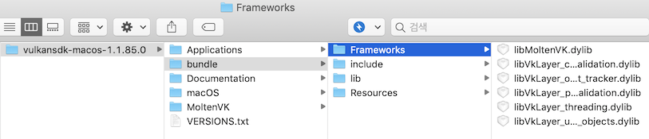

Xcode를 열고 Cocoa App 프로젝트를 생성한다.

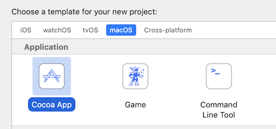

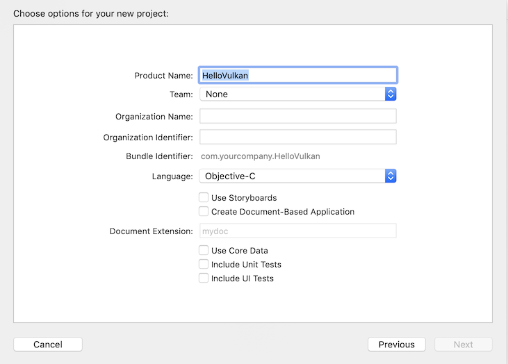

1. Language(언어)는 가능하면 Objective-C 를 이용하는 것을 추천한다. Vulkan 의 경우 C/C++ 언어로 작성되기 때문에 Swift를 사용한다면 브릿지 헤더 등 추가적으로 손대야 하는 부분이 늘어난다.

1. `Use Storyboards` 부분을 체크하느냐 아니냐에 따라서 만들어지는 템플릿 내용이 다르다. 스토리보드를 사용하는 경우는 View Controller가 미리 생성되어 있고, 사용하지 않는 경우에는 App Delegate가 미리 생성되어 있다. 본 Tutorial에서는 GUI부분은 크게 손대지 않을 것이기 때문에 어느 쪽을 선택해도 상관없다. 이후 Tutorial중에도 양쪽을 모두 고려하여 작성할 것이다. 

### 필요한 파일들 복사하기

프로젝트를 생성하고 나면 Finder를 이용하여 프로젝트 루트 디렉토리에 (${프로젝트이름}.xcodeproj 파일이 있는 위치) ["Cocoa 어플리케이션 번들을 위한 준비"][cocoa_bundle_ready] 에서 준비한 `bundle` 디렉토리를 복사한다. 

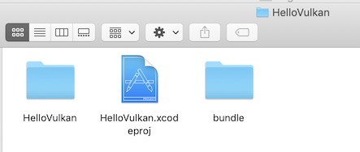

### 프로젝트 설정하기

다시 Xcode로 돌아와서 왼쪽 프로젝트 네비게이터에서 프로젝트를 선택 -> `Build Phases` 를 선택한다.

   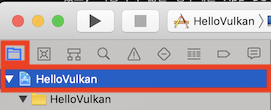

   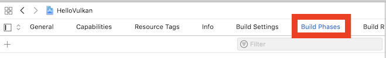

#### 1. Vulkan 라이브러리 등록하기

먼저 Vulkan 라이브러리를 추가하도록 하자. `Link Binary With Libraries` 항목을 선택하신 후 하단에 "+" 버튼을 눌러준다.

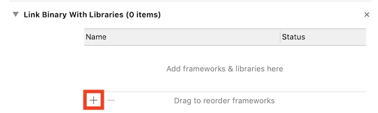

다이얼로그 하단에 **\[Add Other...]** 버튼을 눌러준다.

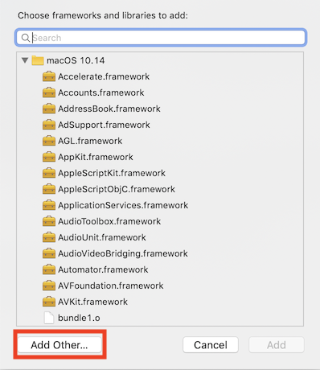

아까 복사한 `bundle` 디렉토리로 이동하여 `lib` 디렉토리 밑에 있는 `libvulkan.1.1.xx.dylib` 파일을 선택한다.

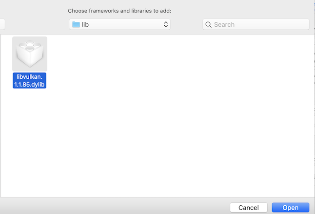

아래와 같이 라이브러리가 프로젝트에 추가된 것을 확인한다.

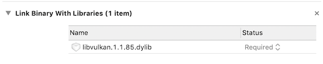

빌드 시의 설정은 되었고 패키징 할 때 같이 복사될 수 있도록 규칙을 추가하도록 하자. 먼저 `Build Phases` 화면에서 왼쪽 상단의 "+" 버튼을 누른 후 "New Copy File Phase" 를 선택한다.

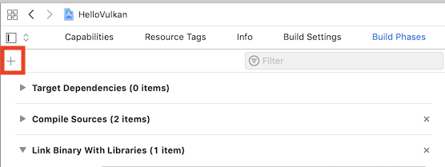

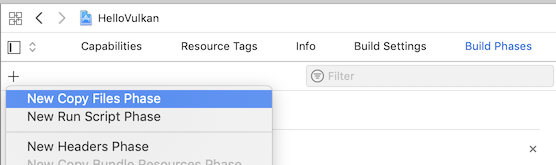

제일 하단에 "Copy Files (0 items)" 항목이 새로 생길 것이다. 해당 항목을 펼쳐보자. **Destination** 으로 "Executables"을 선택하고 파일을 추가하기 위해서 하단에 "+" 버튼을 눌러준다. 여기에 등록된 파일은 패키지 생성 시 실행파일과 같은 위치에 놓이게 된다.

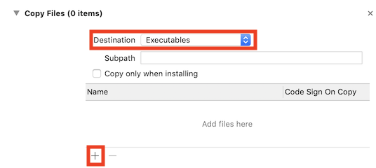

앞서 `Link Binary With Libraries`에서 파일을 한번 읽어왔기 때문에 다이얼 로그 목록 하단의 "Frameworks"에서 `libvulkan.1.1.xx.dylib` 항목을 찾을 수 있다. 선택해서 등록하도록 하자.

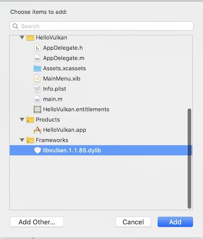

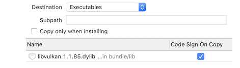

#### 2. Vulkan .json manifest 파일, 드라이버 및 레이어 라이브러리 등록하기

Vulkan에서는 Vulkan 라이브러리를 제외한 드라이버 및 레이어 라이브러리 들은 실행단계에서 동적으로 로딩한다. 따라서 Link 옵션으로 넣어줄 필요는 없고 다만 해당 라이브러리 파일들이 어디에 있는지 적혀있는 .json manifest 파일들과 해당 라이브러리 파일들을 패키징 할 때 같이 복사해 줘야 한다. 

##### 2.1. .json manifest 파일

기본적으로 Vulkan 라이브러리는 .json manifest파일들이 번들 앱의 리소스 경로 (`$(APP_ROOT)/Contents/Resources`) 에 있다고 생각하고 검사를 진행한다. 빌드 시 .json manifest 파일들을 리소스 경로로 복사하도록 설정해 보겠다.

계속해서 `Build Phases` 화면에서 새로운 규칙을 추가하기 위해 왼쪽 상단의 "+" 버튼을 누른 후 "New Copy File Phase" 를 선택한다

제일 하단에 "Copy Files (0 items)" 항목이 새로 생길 것이다. 해당 항목을 펼쳐보자. **Destination** 으로 "Resources"를 선택하고 파일을 추가하기 위해서 하단에 "+" 버튼을 눌러준다.

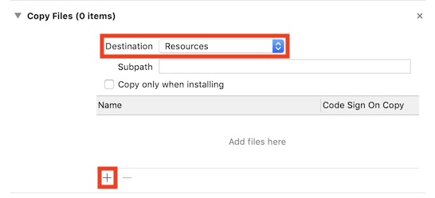

우리는 이미 필요한 파일을 디렉토리로 묶어 놓은 상태다. 파일을 개별적으로 선택할 필요 없이 디렉토리 채로 선택하면 하위 파일모두를 복사한다. 마찬가지로 다이얼로그 하단에 하단에 **\[Add Other...]** 버튼을 눌러준 후 `bundle` 디렉토리로 이동하여 `Resources` 밑에 있는 `vulkan` 디렉토리를 선택한다.

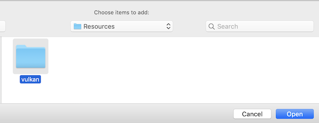

선택 후에 뜨는 창에서는 기본 값인 "Create folder references"로 놔두고 "Finish" 버튼을 누른다. 아래와 같이 추가 됨을 확인할 수 있다.

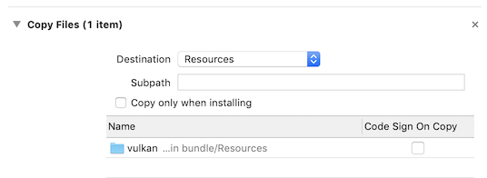

##### 2.2. 드라이버 및 레이어 라이브러리

방법은 바로 위 .json 파일과 같은 요령으로 하면 된다. 먼저 왼쪽 상단의 "+" 버튼을 누른 후 "New Copy File Phase" 를 선택한다. 이번에는 라이브러리 파일이므로 **Destination** 은 "Frameworks"로 선택하도록 하고 하단의 "+" 버튼을 누르도록 하자.

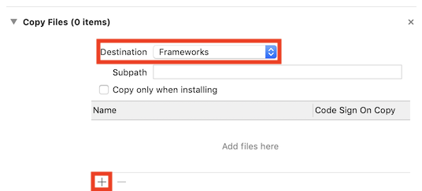

마찬가지로 다이얼로그 하단에 하단에 **\[Add Other...]** 버튼을 눌러준 후 `bundle` 디렉토리로 이동하여 `Frameworks` 밑에 있는 모든 _dylib_ 파일들을 선택하도록 하자.

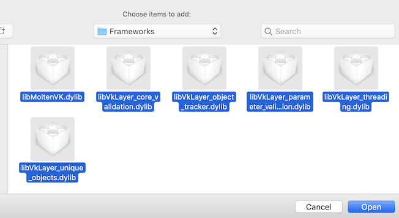

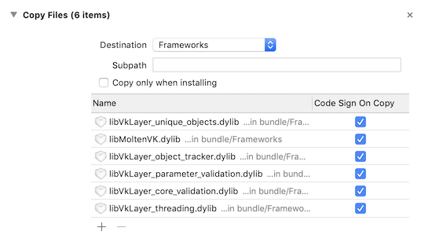

#### 3. Path 설정하기

마지막으로 Xcode가 헤더 및 라이브러리를 찾을 수 있게 경로를 설정해 주도록 하자. 먼저 `Build Settings` 탭을 선택하도록 하자.

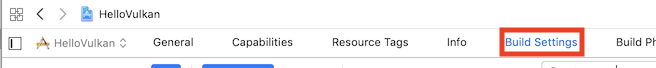

많은 설정들이 있지만 검색 창에 "SEARCH" 라고 검색하면 다음과 같이 목록들이 필터링 된다. 우리가 편집해야 할 부분은 "HEADER_SEARCH_PATHS"와 "LIBRARY_SEARCH_PATHS" 항목이다. 이 중 "LIBRARY_SEARCH_PATHS" 항목은 이미 등록되어 있는 경우가 있는데 앞서 `Build Phases` 탭에서 `Link Binary With Libraries`를 등록하는 과정에서 자동으로 추가된 것이다. 

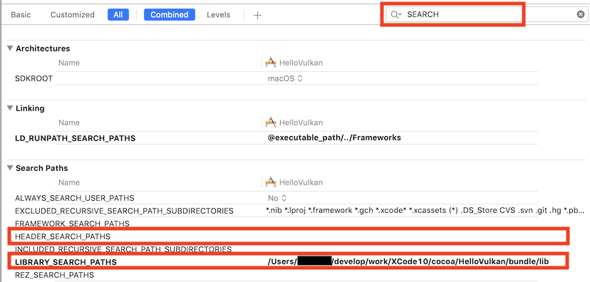

"LIBRARY_SEARCH_PATHS" 항목을 더블 클릭하면 다음과 같은 화면을 볼 수 있다.

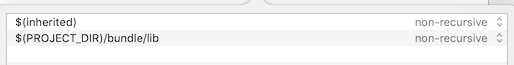

Xcode 에서는 프로젝트 루트 디렉토리 (${프로젝트이름}.xcodeproj 파일이 있는 위치) 가 `$(PROJECT_DIR)` 이라는 매크로로 정의되어 있다. 앞서 우리는 해당 위치에 `bundle` 디렉토리를 복사한 바 있다. _include_ 디렉토리 역시 `bundle` 디렉토리 안에 있으므로 "HEADER_SEARCH_PATHS" 항목을 더블 클릭하고 다음과 같이 설정하도록 하자.

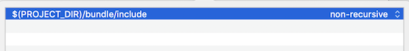

[cocoa_bundle_ready]: vulkan_02_1_env_mac

----------

## Command Line Tool 로 시작하기

먼저 이전 글의 ["Command Line Tool 을 위한 준비"]() 까지 되어 있는지 확인한다. System Path (`/usr/local/` 이하)에 복사한 경우를 기준으로 작성하였다.

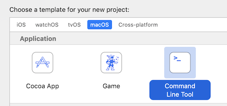

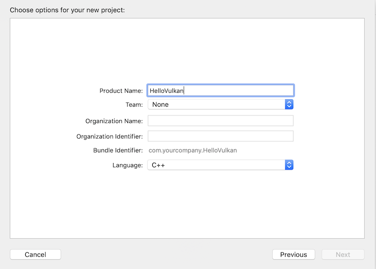

1. Language(언어) 만 C/C++로 선택하면 된다. 단, Tutorial을 진행하다 보면 GUI 부분이 나올 수 있는데, 이 때는 어쩔 수 없이 Objective-C 를 사용해야 한다. 

### Path 설정하기

왼쪽 프로젝트 네비게이터에서 프로젝트를 선택 -> `Build Settings` 를 선택한다.

   

   

많은 설정들이 있지만 검색 창에 "SEARCH" 라고 검색하면 다음과 같이 목록들이 필터링 된다. 우리가 편집해야 할 부분은 "HEADER_SEARCH_PATHS"와 "LIBRARY_SEARCH_PATHS" 항목이다. "HEADER_SEARCH_PATHS"에는 "/usr/local/include" 를 그리고 "LIBRARY_SEARCH_PATHS"에는 "/usr/local/lib"를 추가해 준다.

   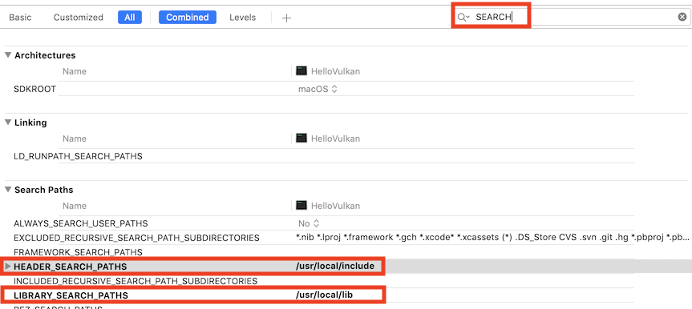

마지막으로 링크 옵션을 걸어주자. 검색 창에 "LDFLAG" 라고 검색하여 "OTHER_LDFLAGS" 항목을 찾는다. "OTHER_LDFLAGS"에 _-lvulkan_ 을 추가한다.

   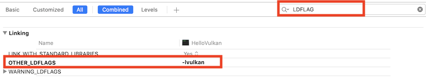
