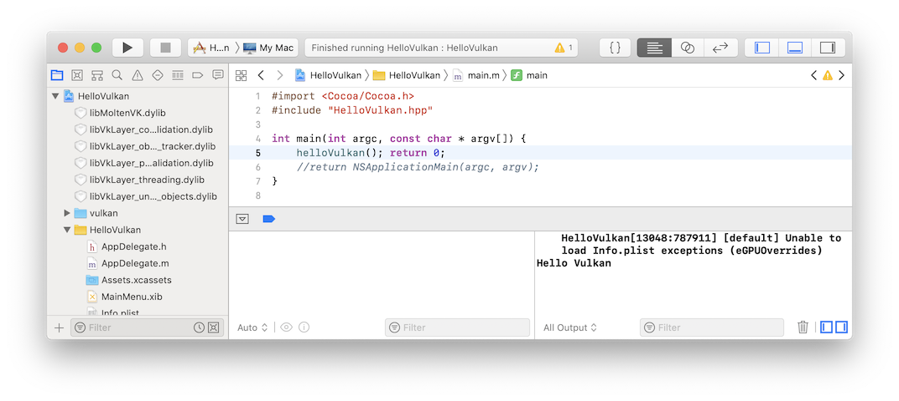
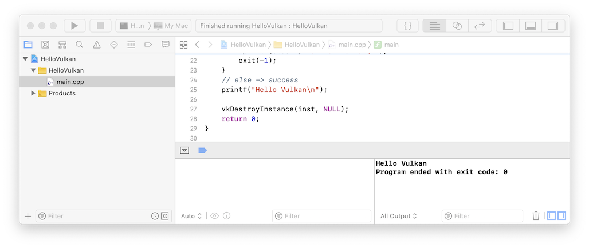

# Hello Vulkan

> NOTE: 본 Tutorial은 편의를 위해서 파일 형식은 _cpp_ 를 사용하지만 _c_ 에서도 호환되도록 STL 및 iostream 등은 사용하지 않고 가능한 _c_ 함수만을 이용해서 작성하였다. 최신 컴파일러에서는 확장자를 _c_ 로 바꾸어도 정상동작한다.

## 간단한 Vulkan 코드 개발하기 (Cocoa 버전)

코코아 앱의 경우 Objective-C 코드 파트와 분류하기 위해서 별도로 헤더와 소스코드를 만들어서 진행하도록 하겠다. 우선 간단한 예제를 위해서 HelloVulkan.h/cpp 파일을 만들어서 다음 내용을 입력하도록 하자. cpp 헤더를 자동 생성할 경우 파일 확장자가 _hpp_ 인데 반드시 _h_ 로 바꿀 필요는 없다. Include 시 파일 이름만 주의해 주면 된다.

HelloVulkan.h
 
```cpp
#ifndef _HELLO_VULKAN_H_
#define _HELLO_VULKAN_H_

#ifdef __cplusplus
extern "C" {
#endif

void helloVulkan();

#ifdef __cplusplus
}
#endif

#endif
```

HelloVulkan.cpp

```cpp
#include <vulkan/vulkan.h>
#include <stdio.h>
#include <stdlib.h>

#include "HelloVulkan.h"

void helloVulkan()
{
    // initialize the VkInstanceCreateInfo structure
    VkInstanceCreateInfo inst_info = {};
    inst_info.sType = VK_STRUCTURE_TYPE_INSTANCE_CREATE_INFO;

    VkInstance inst;
    VkResult res;

    res = vkCreateInstance(&inst_info, NULL, &inst);
    
	if (res == VK_ERROR_INCOMPATIBLE_DRIVER) {
        fprintf(stderr, "cannot find a compatible Vulkan ICD\n");
        exit(-1);
    }
    else if (res) {
        fprintf(stderr, "unknown error\n");
        exit(-1);
    }
    // else -> success
    printf("Hello Vulkan\n");
    
    vkDestroyInstance(inst, NULL);
}
```

아직은 GUI와 연계되는 부분은 없으므로, `main()`에서 호출해 보도록 하겠다. 프로젝트 목록에서 `main.m` 파일을 열고 다음과 같이 편집한다.

main.m

```objc
#import <Cocoa/Cocoa.h>
#include "HelloVulkan.h"

int main(int argc, const char * argv[]) {
    helloVulkan(); return 0;
    // return NSApplicationMain(argc, argv); // 여기는 잠시 주석처리 하자
}
```

## Vulakn 코드 컴파일 하기

_Product_ 메뉴 상의 **"Build"** (단축키: Command + B) 로 빌드 후, **"Run"** (단축키: Command + R) 로 실행해 보자.

Xcode 하단에 콘솔 캡쳐 화면에 "Hello Vulkan" 이라는 메시지가 떳다면 프로그램이 정상적으로 실행하고 종료되었음을 의미한다.

> NOTE: macOS 10.14에서 Xcode10 으로 실행 시, "\[default] Unable to load Info.plist exceptions (eGPUOverrides)" 같은 메시지가 출력되는 경우도 있는데, 이 메시지는 무시해도 상관없다고 한다. (Xcode 버그로 향후 버전에서 패치 예정이라는 말이 있다.)



---------

## 간단한 Vulkan 코드 개발하기 (Command Line Tool 버전)

main.cpp

```cpp
#include <vulkan/vulkan.h>
#include <stdio.h>
#include <stdlib.h>

int main(void)
{
    // initialize the VkInstanceCreateInfo structure
    VkInstanceCreateInfo inst_info = {};
    inst_info.sType = VK_STRUCTURE_TYPE_INSTANCE_CREATE_INFO;

    VkInstance inst;
    VkResult res;

    res = vkCreateInstance(&inst_info, NULL, &inst);
    
    if (res == VK_ERROR_INCOMPATIBLE_DRIVER) {
        fprintf(stderr, "cannot find a compatible Vulkan ICD\n");
        exit(-1);
    }
    else if (res) {
        fprintf(stderr, "unknown error\n");
        exit(-1);
    }
    // else -> success
    printf("Hello Vulkan\n");
    
    vkDestroyInstance(inst, NULL);
    return 0;
}
```

## Vulakn 코드 컴파일 하기

_Product_ 메뉴 상의 **"Build"** (단축키: Command + B) 로 빌드 후, **"Run"** (단축키: Command + R) 로 실행해 보자.

Xcode 하단에 콘솔 캡쳐 화면에 "Hello Vulkan" 이라는 메시지가 떳다면 프로그램이 정상적으로 실행하고 종료되었음을 의미한다.




