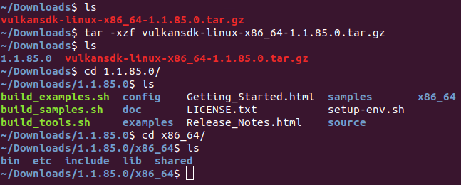

# Getting Started

## 사전 준비

우리는 C/C++ 언어를 사용하여 Vulkan 앱을 개발할 것이다. 당연히 C/C++ 개발 환경이 마련되어 있어야 한다. 본 Tutorial은 gcc 와 make를 이용해서 작성되었다. GUI 부분은 xlib를 사용하였다. 다음 command를 사용하면 개발 툴 및 xlib 를 설치할 수 있다.

패키지 상태가 최신임을 확인하자
```sh
$ sudo apt-get update
$ sudo apt-get dist-upgrade
```

그리고 패키지를 설치해준다. build-essential package에는 gcc, g++, make 등이 포함되어 있다.

```sh
$ sudo apt-get install build-essential libx11-dev
```

> NOTE: Cross Platform 지원 입장에서는 윈도우 생성에 glfw3와 같은 third-party library를 사용하는 방법도 있을 것이다. glfw3를 이용하여 Vulkan 앱을 만드는 방법은 향후 업데이트 예정이다.

> NOTE: 현재 Tutorial은 xlib를 이용한 방법만 제공하고 있는데 향후 xcb를 이용하는 방법도 업데이트 예정이다.

## Vulkan Driver

먼저 Vulkan 개발에 앞서 자신의 그래픽 카드가 Vulkan 드라이버를 지원하는지 부터 확인해야 한다. Vulkan 지원 여부는 각 Vendor의 홈페이지나 [여기](https://vulkan.gpuinfo.org/) 또는 [wiki](https://en.wikipedia.org/wiki/Vulkan_(API)#Compatibility)에서 확인할 수 있다.

Intel Graphics 카드의 경우 공식적으로는 6세대 Skylake 이후 모델부터 Vulkan Driver를 지원하지만 Ubuntu의 경우, mesa 드라이버를 통해서 그 이전 버전의 GPU에서도 작동됨을 확인하였다. (단, Skylake 이전 모델에서는 version 1.1의 기능은 지원하지 않는다고 한다.) 실제로 필자의 경우도 Intel HD Graphics 5500 (Broadwell GT2) 환경에서 해당 Tutorial을 작성하였다.

### Driver 설치하기

먼저 자신의 PC에 Vulkan Driver가 설치되어 있는지 확인해야 한다.

- Nvidia의 경우 [홈페이지](https://www.nvidia.com/Download/index.aspx)를 통해서 최신 드라이버를 설치해주면 된다. (우분투 18.04 버전 이후에는 apt를 통해서도 배포되고 있다)

- AMD의 경우 [홈페이지](https://www.amd.com/support)를 통해서 최신 드라이버를 설치해주면 된다. 또는 apt를 통해 Mesa Vulkan Driver를 설치해줘도 된다.

- Intel의 경우 apt를 통해 Mesa Vulkan Driver를 설치하면 된다.

AMD 및 Intel의 경우 apt를 통해서 Mesa Vulkan Driver를 설치하고자 한다면, 아래 명령어를 실행해 주면 된다.
```sh
$ sudo apt-get install mesa-vulkan-drivers
```

### 설치 확인하기

만약 드라이버가 정상적으로 설치되었다면 `/usr/share/vulkan/icd.d/` 또는 `/etc/vulkan/icd.d/`에 .json 파일이 있어야 한다. 보통 apt를 통해서 driver를 설치할 경우, `/usr/share/vulkan/icd.d/`에서 json파일을 발견할 수 있다.

이 파일들은 Vulkan Loader를 위한 파일들인데 이 부분에 대해서 나중에 기회가 되었을 때 다시 설명하도록 하고 지금은 생략하겠다. 그래도 궁금하신 분들은 공식 문서 [[Vulkan Common Loader]](https://vulkan.lunarg.com/doc/view/latest/linux/loader_and_layer_interface.html) 를 참조하기 바란다.

## Vulkan SDK

Vulkan 개발에 앞서 우선 SDK를 설치해 보도록 하자.
Vulkan SDK는 LunarG 홈페이지를 통해서 공식 배포되고 있다. 

[https://vulkan.lunarg.com/sdk/home](https://vulkan.lunarg.com/sdk/home)

** 이 문서를 작성한 시점에서 최신버전은 1.1.85.0 버전이다.

Ubuntu의 경우 APT를 통해서 SDK 패키지를 설치할 수 있는데, 이 문서를 작성한 시점에서 등록되어 있는 버전은 1.1.70.0 이었다. 하지만 glsl to spir-v 컴파일러 같은 유틸리티는 포함되어 있지 않기 때문에 유틸리티 툴 때문이라도 홈페이지에서 다운로드 받아야 한다. 1.1.85.0에 포함된 툴을 사용하여 glsl을 컴파일 하더라고 1.1.70.0에서 사용하는데 아무 문제 없으므로, 툴만 빼서 쓰고 SDK는 apt를 이용해서 설치해도 된다.

### 홈페이지에서 다운 받아 설치하기

1. 먼저 위의 홈페이지에서 vulkansdk-linux-x86_64-1.1.xx.y.tar.gz 를 다운로드 받는다. (xx.y는 버전)

2. 적당한 곳에 압축을 푼다
    ```sh
    $ tar -xzf vulkansdk-linux-x86_64-1.1.xx.y.tar.gz
    ```
    압축을 풀면 `1.1.xx.y` 디렉토리가 생성되어 있을 것이다. 해당 디렉토리의 경로를 이후 `$VULKAN_ROOT` 라고 하겠다.

3. `$VULKAN_ROOT` 디렉토리에 들어가 보면 `x86_64` 디렉토리를 찾을 수 있다. 해당 디렉토리 안에 이미 build 되어 있는 SDK 및 Tool 들이 들어있다. 아래 스크린샷은 현재 단계까지의 과정을 보여준다.

    

4. 설치하는 방법은 사람마다 다르다. PATH 및 LD_LIBRARY_PATH 환경 변수를 설정하는 방법이 있고, 아니면 /usr/local/lib 와 같이 system path에 직접 Library 파일들을 복사하는 방법도 있다. 아래 2 방법 중에 자신이 원하는 방법으로 설치하기 바란다.

    > NOTE: 당연히 말이지만 아래에 나오는 `$VULKAN_ROOT`는 2번에서 언급한 디렉토리 경로로 치환해서 사용해야 한다

    #### 4.1. 환경변수를 설정하는 방법

    환경 변수를 직접 설정하고 싶다면 최소 다음 3가지를 등록하면 된다.

    | Enviroment Variable | File / Path to Include                             |
    | ---                 | ---                                                |
    | PATH                | `$VULKAN_ROOT`/x86_64/bin                          |
    | LD_LIBRARY_PATH     | `$VULKAN_ROOT`/x86_64/lib                          |
    | VK_LAYER_PATH       | `$VULKAN_ROOT`/x86_64/etc/vulkan/explicit_layer.d  |

    직접 `export` 명령어를 이용하여 등록해도 괜찮고, `$VULKAN_ROOT` 디렉토리에 보면 `setup-env.sh` 라고 script 파일이 있으니 이를 실행해도 된다.

    **[ Script를 이용해서 등록하기 ]**
    ```sh
    $ source $VULKAN_ROOT/setup-env.sh
    ```

    **[ export 명령어로 직접 등록하기 ]**
    ```sh
    $ export PATH=$VULKAN_ROOT/x86_64/bin:$PATH
    $ export LD_LIBRARY_PATH=$VULKAN_ROOT/x86_64/lib:$LD_LIBRARY_PATH
    $ export VK_LAYER_PATH=$VULKAN_ROOT/x86_64/etc/vulkan/explicit_layer.d
    ```

    #### 4.2. System Path 에 직접 복사하는 방법

    환경 변수를 사용하지 않고 직접 System Path에 위 파일들을 복사하는 방법도 있다. 일반적으로 가장 많이 사용되는 디렉토리는 `/usr` 이며 보통은 `/usr/local`밑으로 복사한다.

    먼저 Tool과 Library 파일들을 복사한다. System Path이기 때문에 sudo 커멘드를 사용해야 한다.
    ```sh
    $ sudo cp $VULKAN_ROOT/x86_64/bin/* /usr/local/bin/
    $ sudo cp -R $VULKAN_ROOT/x86_64/lib/* /usr/local/lib/
    $ sudo ldconfig
    ```

    다음은 Vulkan validation layers 용 .json manifest 파일들을 복사해줘야 한다. 일반적으로 `/etc/vulkan/` 밑으로 복사해 주면 된다.
    ```sh
    $ sudo mkdir -p /etc/vulkan/explicit_layer.d
    $ sudo cp $VULKAN_ROOT/x86_64/etc/vulkan/explicit_layer.d/* /etc/vulkan/explicit_layer.d/
    ```

    > CAUTION : `VK_LAYER_PATH` 환경변수가 없어야 한다. 

5. 마지막으로 Include Path를 잡아주면 된다. gcc에서 직접 -I 옵션을 통해 직접 경로를 지정해도 되지만 편의를 위해서 System Path에 복사를 해주도록 하자.

    > NOTE: 당연히 말이지만 아래에 나오는 `$VULKAN_ROOT`는 2번에서 언급한 디렉토리 경로로 치환해서 사용해야 한다

    ```sh
    $ sudo cp -R $VULKAN_ROOT/x86_64/include/* /usr/local/include/
    ```

### apt 를 통해서 설치하기

```sh
$ sudo apt-get install libvulkan-dev
```

위에서 언급했지만 apt를 통해서 설치할 수 있는것은 Library 파일들과 Vulkan validation layers 용 .json manifest 파일들이다. glsl to spir-v 컴파일러와 같은 툴은 포함되어 있지 않다. 해당 툴들은 바로 위 [**[홈페이지에서 다운 받아 설치하기]**](#홈페이지에서-다운-받아-설치하기) 를 참조하여 `$VULKAN_ROOT/x86_64/bin/` 밑의 파일들을 설치하면 된다. 
