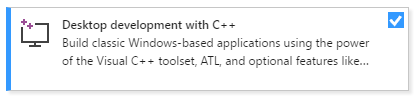

# Getting Started

## 사전 준비

우리는 C/C++ 언어를 사용하여 Vulkan 앱을 개발할 것이다. 당연히 C/C++ 개발 환경이 마련되어 있어야 한다. 본 Tutorial은 Visual Studio 2017을 이용해서 작성되었다.

Visual Studio는 [여기](https://visualstudio.microsoft.com)에서 다운 받아 설치할 수 있다. 

> NOTE: VS2017 기준 C/C++ 지원을 반드시 설치해야 합니다. 설치 방법은 [여기](https://docs.microsoft.com/cpp/build/vscpp-step-0-installation?view=vs-2017)를 참고하세요
>
> 

> NOTE: Cross Platform 지원 입장에서는 윈도우 생성에 glfw3와 같은 third-party library를 사용하는 방법도 있을 것이다. glfw3를 이용하여 Vulkan 앱을 만드는 방법은 향후 업데이트 예정이다.

## Vulkan Driver 설치하기

먼저 Vulkan 개발에 앞서 자신의 그래픽 카드가 Vulkan 드라이버를 지원하는지 부터 확인해야 한다. Vulkan 지원 여부는 각 Vendor의 홈페이지나 [여기](https://vulkan.gpuinfo.org/) 또는 [wiki](https://en.wikipedia.org/wiki/Vulkan_(API)#Compatibility)에서 확인할 수 있다.

Intel Graphics 카드는 좀 까다로은데 Windows OS의 경우 beta 드라이버가 끝나면서 6세대 Skylake 이상 모델에 한해서만 Vulkan Driver를 지원한다.

필자의 노트북이 5세대 HD 5500을 사용하는데 안타깝게 구동에 실패했다 ㅜㅜ

Vulkan Driver는 별도로 설치할 필요는 없으며, 대부분 최신 버전의 그래픽 카드 드라이버를 설치할 떄 같이 설치 된다.

## Vulkan SDK

Vulkan 개발에 앞서 우선 SDK를 설치해 보도록 하자.
Vulkan SDK는 LunarG 홈페이지를 통해서 공식 배포되고 있다. 

[https://vulkan.lunarg.com/sdk/home](https://vulkan.lunarg.com/sdk/home)

** 이 문서를 작성한 시점에서 최신버전은 1.1.85.0 버전이다.

개발자용만 다운 받으면 된다.

설치는 특별히 어려운 것은 없다. 중간에 설치 할 위치만 지정해 주면 된다. 기본 설치 위치는 `C:\VulkanSDK\{다운받은 버전}` 이 된다.

## Visual Studio Project Template

Vulkan SDK 설치 경로를 확인하면, `Template` 폴더에 Visual Studio 용 템플릿 파일이 존재한다. 해당 템플릿을 사용하면 매번 프로젝트 생성 때마다 Path 설정을 안해도 되므로 적극 활용해 보도록 하자.

참고로 Visual Studio 의 템플릿 디폴트 설치 경로는 아래와 같다.

```text
C:\Users\username\Documents\Visual Studio 201x\Templates\ProjectTemplates\Visual C++ Project
```

