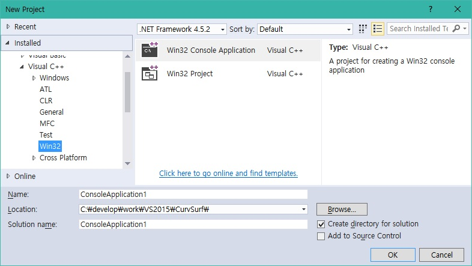
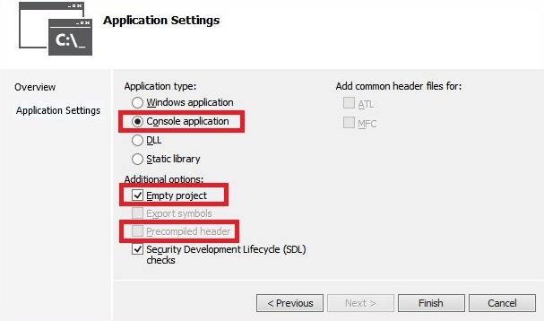
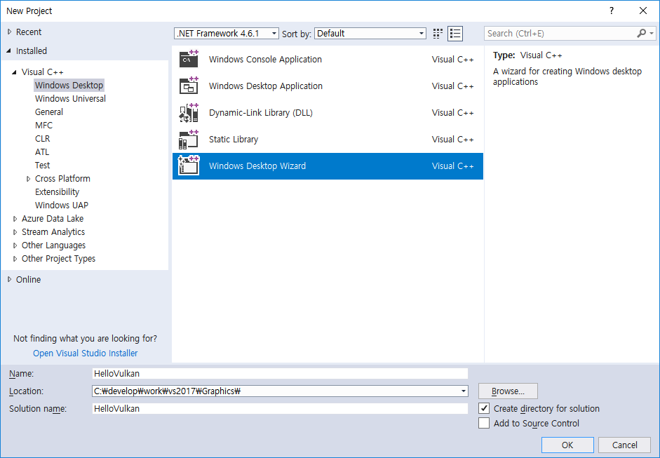
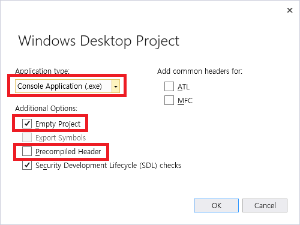
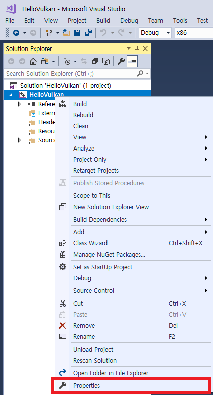
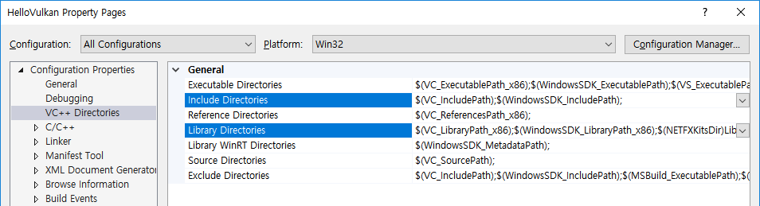
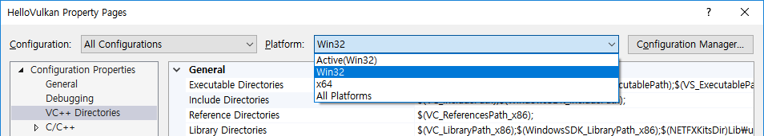
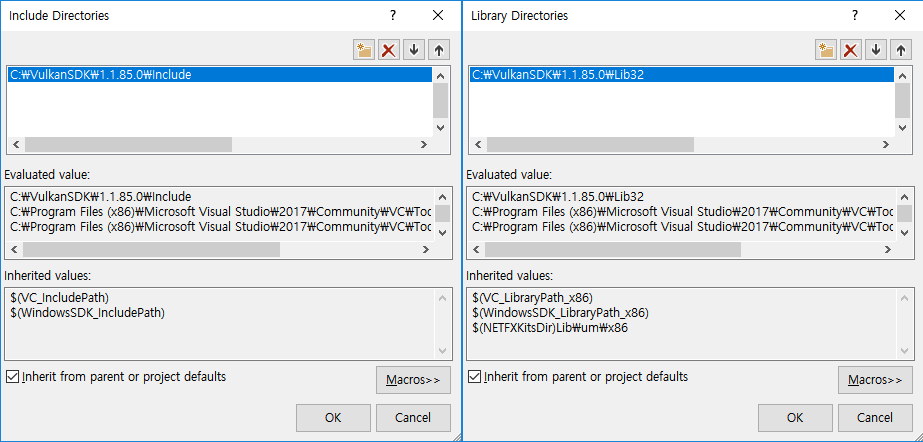
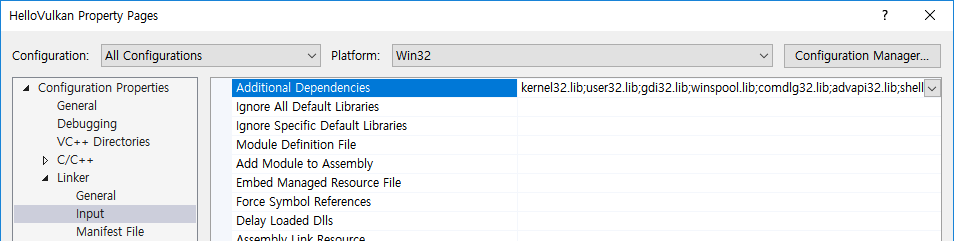
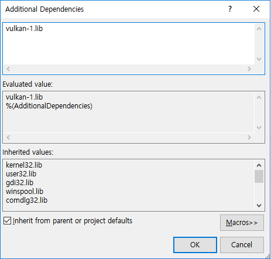

# Vulkan 프로젝트를 위해 Visual Studio 준비하기

## 1. Project 생성하기

편의를 위해서 "Windows Console Application" 프로젝트를 준비하도록 하자. 콘솔 출력 (printf 등) 이 필요없는 사람은 "Windows Desktop Application"으로 준비해도 상관없다. VS 2015의 경우 "Win32 Console Application" 또는 "Win32 Application" 이다. 

본 Tutorial은 pre-compiled header를 사용하지 않는다. VS 2015 사용자는 프로젝트 생성 마지막 과정에 "Empty Project" 항목을 체크하면 자동으로 "Precompiled Header" 항목이 비활성화 된다. 

VS 2017 사용자는 프로젝트 생성 시, "Windows Console Application" 을 선택하지 말고 "Windows Desktop Wizard" 항목을 선택하도록 하자. 이후 뜨는 Wizard 화면에서 "Precompiled Header" 항목의 체크를 해제하고 "Empty Project" 항목을 체크하도록 하자.

* **VS 2015**

   
   

* **VS 2017**

   
   

## 2. Project Path 설정하기

다음은 Vulkan 앱을 빌드하기에 앞서 필요한 Header 파일들과 Library 파일들을 프로젝트에 연결시켜주는 과정이 필요하다.

1. **"Project Property(속성)"** 창을 열어준다.
   
   

1. **"VC++ Directories"** 항목에서 **"Include Directories"** 와 **"Library Directories"** 항목을 편집할 것이다.

   

   > NOTE: Property(속성) 창 상단의 **"Platform"** 에 주의하자. 일반적으로 _Win32(x86)_ 과 _x64_ 2가지 속성이 존재한다. 
   >
   > 
   >
   > **"Platform"** 별로 설정을 별도로 저장하므로 각 **"Platform"** 마다 설정을 편집해야 한다.

   **"Include Directories"** 에 Vulkan SDK 가 설치된 폴더내의 "Include" 폴더의 절대 경로를 추가한다. 디폴트 경로는 `C:\VulkanSDK\1.1.xx.y\Include` 다.

   **"Library Directories"** 에 Vulkan SDK 가 설치된 폴더내의 "Lib32" 또는 "Lib" 폴더의 절대 경로를 추가한다. **"Platform"** 이 _Win32_ 일 경우 "Lib32", _x64_ 인경우 "Lib" 폴더의 경로를 추가하면 된다. 디폴트 경로는 `C:\VulkanSDK\1.1.xx.y\Lib32` 또는 `C:\VulkanSDK\1.1.xx.y\Lib` 다.

   

## 3. Vulkan Loader Library 추가하기

컴파일 시, Vulkan Loader Library를 링크할 수 있도록 추가한다. **"Project Property(속성)"** 창을 열고, 왼쪽 목록에서 **"Linker(링커)" -> "Input(입력)"** 항목을 선택한다.

> NOTE: 이 설정 역시 **"Platform"** 마다 별도 저장되는 점을 유의하자.

**"Additional Dependencies"** 에 "vulkan-1.lib" 를 추가한다.

