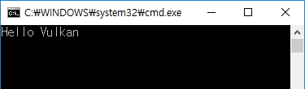

# Hello Vulkan

> NOTE: 본 Tutorial은 편의를 위해서 파일 형식은 _cpp_ 를 사용하지만 _c_ 에서도 호환되도록 STL 및 iostream 등은 사용하지 않고 가능한 _c_ 함수만을 이용해서 작성하였다. 최신 컴파일러에서는 확장자를 _c_ 로 바꾸어도 정상동작한다.

## 간단한 Vulkan 코드 개발하기

Project에 "main.cpp" 파일을 추가하고 아래 코드를 입력하자.

main.cpp

```cpp
#include <vulkan/vulkan.h>
#include <stdio.h>
#include <stdlib.h>

int main(void)
{
    // initialize the VkInstanceCreateInfo structure
    VkInstanceCreateInfo inst_info = {}; // c 에서는 {0, } 로 수정 필요
    inst_info.sType = VK_STRUCTURE_TYPE_INSTANCE_CREATE_INFO;

    VkInstance inst;
    VkResult res;

    res = vkCreateInstance(&inst_info, NULL, &inst);
    
    if (res == VK_ERROR_INCOMPATIBLE_DRIVER) {
        fprintf(stderr, "cannot find a compatible Vulkan ICD\n");
        exit(-1);
    }
    else if (res) {
        fprintf(stderr, "unknown error\n");
        exit(-1);
    }
    // else -> success
    printf("Hello Vulkan\n");
    
    vkDestroyInstance(inst, NULL);
    return 0;
}
```

## Vulakn 코드 컴파일 하기

메뉴 상의 **"Build" -> "Build Solution"** (단축키: F7) 로 빌드 후, **"Debug" -> "Start Without Debugging"** (단축키: Ctrl + F5) 로 실행해 보자.

